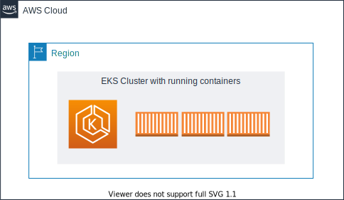

# 워크샵 소개
워크샵 진행 순서는 아래와 같습니다.

- AWS Cloud9을 통한 실습 환경 구축

- 도커를 이용하여 컨테이너 이미지 생성

- 컨테이너 이미지를 ECR에 업로드

- Amazon EKS 클러스터 구축 및 서비스 배포

- Container Insights 사용해보기

- 파드 및 클러스터 오토 스케일링

- AWS Fargate로 서비스 올리기

- CI/CD 파이프라인 구축

워크샵을 시작하기에 앞서 아래의 개념을 명확히 합니다.

- Kubernetes(k8s) 란?

- Amazon EKS

[Previous](../README.md) | [Next](./100-k8s.md)