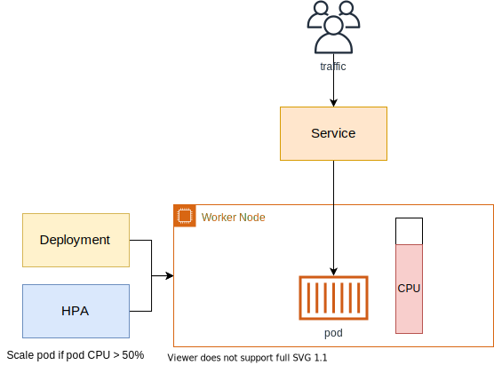
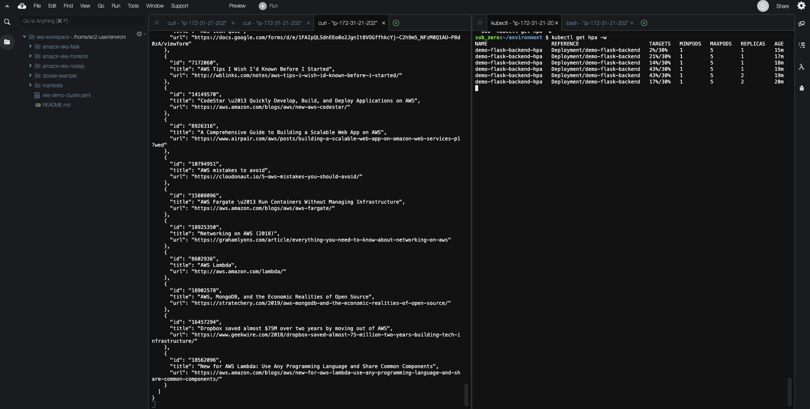

# HPA 적용하기

## HPA를 사용하여 파드 스케일링 적용하기
HPA(Horizontal Pod Autoscaler) 컨트롤러는 메트릭 값에 값에 따라 파드의 개수를 할당합니다. 파드 스케일링을 적용하기 위해 컨테이너에 필요한 리소스 양을 명시하고, HPA를 통해 스케일할 조건을 작성해야 합니다.



1. 쿠버네티스 metrics server를 생성합니다. Metrics Server는 쿠버네티스 클러스터 전체의 리소스 사용 데이터를 집계합니다. 각 워커 노드에 설치된 kubelet을 통해서 워커 노드나 컨테이너의 CPU 및 메모리 사용량 같은 메트릭을 수집합니다.

```
kubectl apply -f https://github.com/kubernetes-sigs/metrics-server/releases/latest/download/components.yaml
```

2. 아래의 명령어를 통해, metrics server가 정상적으로 생성되었는지 확인합니다.

```
kubectl get deployment metrics-server -n kube-system
```

3. 그 다음, [첫번째 백앤드 배포하기](https://catalog.us-east-1.prod.workshops.aws/workshops/9c0aa9ab-90a9-44a6-abe1-8dff360ae428/ko-KR/70-deploy-service/100-flask-backend)에서 만들었던 flask deployment yaml 파일을 아래와 같이 수정합니다. 해당 작업을 통해, 레플리카를 1로 설정하고 컨테이너에 필요한 리소스 양을 설정합니다.

```
cd /home/ec2-user/environment/manifests

cat <<EOF> flask-deployment.yaml
---
apiVersion: apps/v1
kind: Deployment
metadata:
  name: demo-flask-backend
  namespace: default
spec:
  replicas: 1
  selector:
    matchLabels:
      app: demo-flask-backend
  template:
    metadata:
      labels:
        app: demo-flask-backend
    spec:
      containers:
        - name: demo-flask-backend
          image: $ACCOUNT_ID.dkr.ecr.$AWS_REGION.amazonaws.com/demo-flask-backend:latest
          imagePullPolicy: Always
          ports:
            - containerPort: 8080
          resources:
            requests:
              cpu: 250m
            limits:
              cpu: 500m
EOF
```

1vCPU = 1000m(milicore)

4. yaml 파일을 적용하여 변경 사항을 반영합니다.

```
kubectl apply -f flask-deployment.yaml
```

5. HPA를 설정하기 위해, 아래의 yaml 파일도 생성합니다.

```
cat <<EOF> flask-hpa.yaml
---
apiVersion: autoscaling/v1
kind: HorizontalPodAutoscaler
metadata:
  name: demo-flask-backend-hpa
  namespace: default
spec:
  scaleTargetRef:
    apiVersion: apps/v1
    kind: Deployment
    name: demo-flask-backend
  minReplicas: 1
  maxReplicas: 5
  targetCPUUtilizationPercentage: 30
EOF
```

해당 yaml 파일을 반영합니다.

```
kubectl apply -f flask-hpa.yaml
```

아래와 같이 kubectl로 간단하게 설정할 수도 있습니다.

```
kubectl autoscale deployment demo-flask-backend --cpu-percent=30 --min=1 --max=5
```

6. HPA를 생성한 다음, 아래의 명령어로 HPA 상태를 확인할 수 있습니다. target에서 CPU 사용률이 unknown으로 나올 경우, 잠시 기다린 후, 확인합니다.

```
kubectl get hpa
```

7. 오토스케일링 기능이 정상적으로 작동하는지 확인하기 위해 간단한 부하 테스트를 진행합니다. 먼저, 파드의 변화량을 파악하기 위해 아래의 명령어를 입력합니다.

```
kubectl get hpa -w
```

그리고 Cloud9에서 새로운 터미널을 추가로 생성하여 부하 테스트를 진행합니다.

```
ab -c 200 -n 200 -t 30 http://$(kubectl get ingress/backend-ingress -o jsonpath='{.status.loadBalancer.ingress[*].hostname}')/contents/aws
```

아래의 화면처럼 한쪽에서는 부하를 주고, 한쪽에서는 그에 따른 파드의 변화량을 관찰할 수 있습니다. 부하에 따라 REPLICAS 값이 최대 5까지 변경 됨을 파악할 수 있습니다.



[여기](https://aws.amazon.com/ko/blogs/korea/how-to-loading-test-based-on-aws/) 를 클릭하면 AWS 기반 웹 애플리케이션 서버 부하 테스트에 대한 다양한 정보를 얻을 수 있습니다.

[Previous](./100-scaling.md) | [Next](./200-cluster-scaling.md)