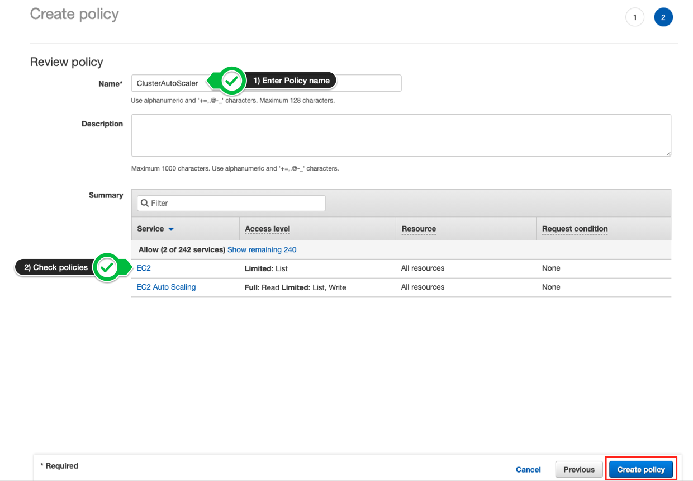
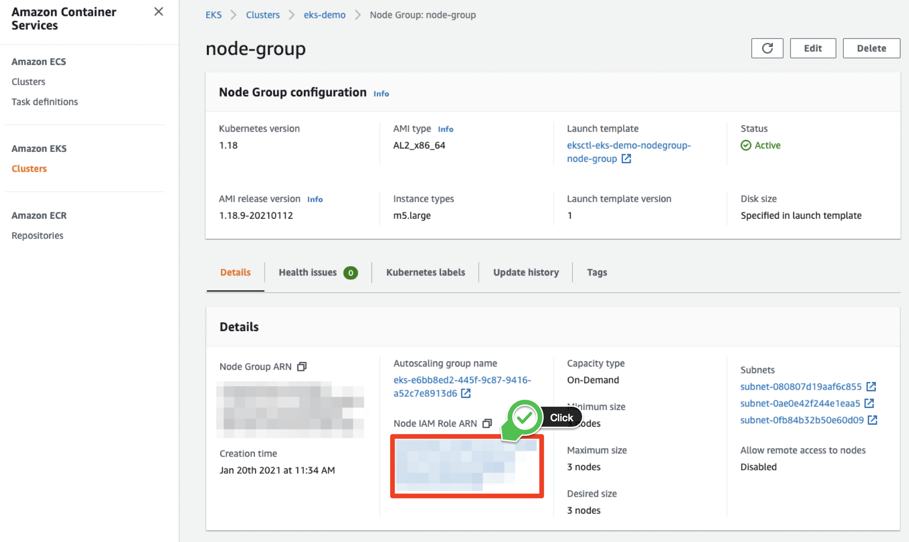
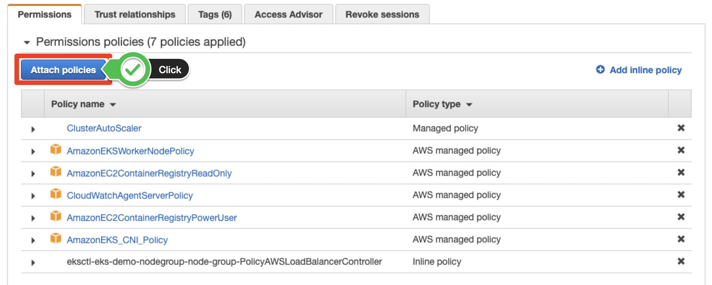
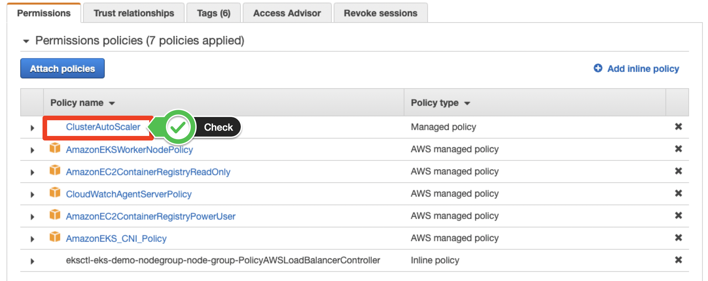
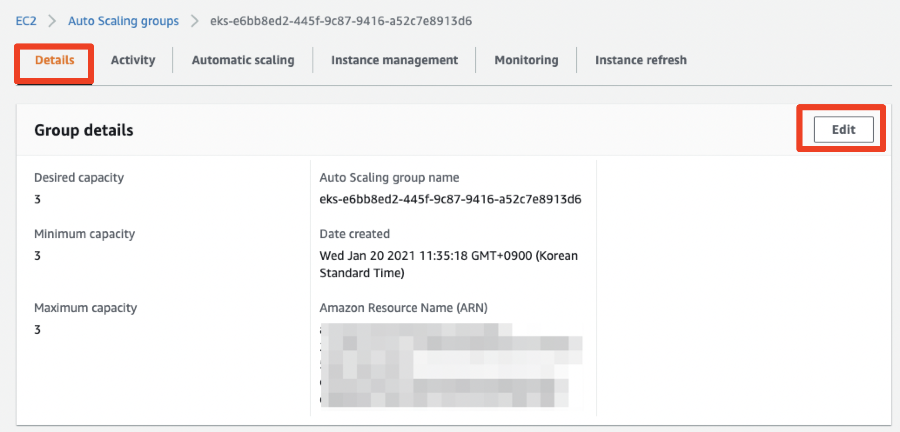
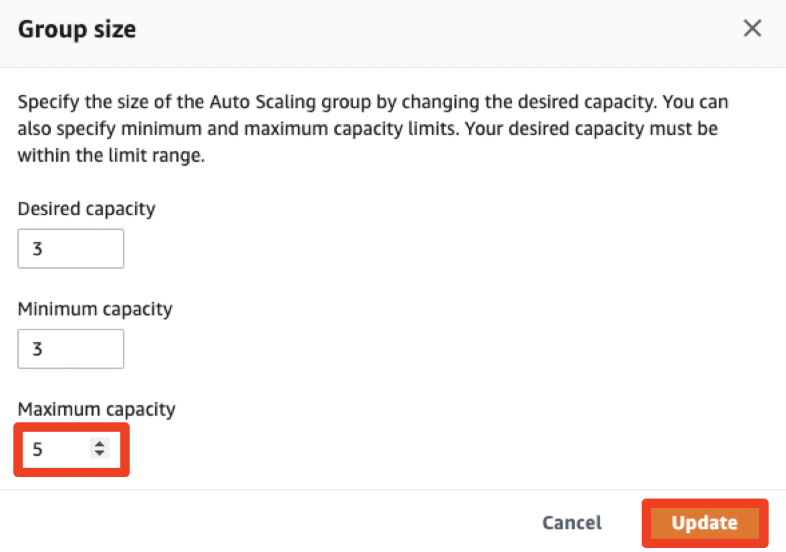
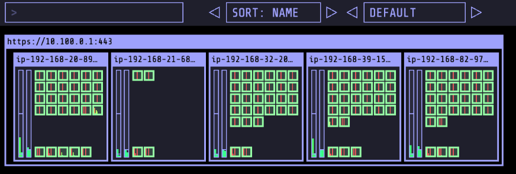

# Cluster Autoscaler 적용하기

## Cluster Autoscaler를 사용하여 클러스터 스케일링 적용하기

이전 페이지에서 파드에 오토 스케일링을 적용하였습니다. 하지만 트래픽에 따라 파드가 올라가는 워커 노드 자원이 모자라게 되는 경우도 발생하게 됩니다. 즉, 워커 노드가 가득 차서 파드가 스케줄될 수 없는 상태가 되는 것이죠. 이때, 사용하는 것이 Cluster Autoscaler(CA) 입니다.


Cluster Autoscaler(CA)는 pending 상태인 파드가 존재할 경우, 워커 노드를 스케일 아웃합니다. 특정 시간을 간격으로 사용률을 확인하여 스케일 인/아웃을 수행합니다. 그리고 AWS에서는 Auto Scaling Group을 사용하여 Cluster Autoscaler를 적용합니다.


[!] (선택) 위의 이미지처럼 현재 클러스터의 상태를 시각화하기 위해선 kube-ops-view 를 참고합니다.

1. 아래의 명령어로 현재 클러스터의 워커노드에 적용된 ASG(Auto Scaling Group)의 값을 확인합니다.

```
aws autoscaling \
    describe-auto-scaling-groups \
    --query "AutoScalingGroups[? Tags[? (Key=='eks:cluster-name') && Value=='eks-demo']].[AutoScalingGroupName, MinSize, MaxSize,DesiredCapacity]" \
    --output table
```


본 실습에서는 EKS 클러스터를 배포할 때, auto scaling과 관련된 IAM policy를 붙여주는 작업을 미리 수행하였습니다. 하지만 해당 작업을 수행하지 않은 경우, 아래의 숨은 폴더를 클릭하여 관련 IAM 정책을 생성하고 IAM 역할에 붙이는 작업을 수행합니다.

<details>
<summary>Auto Scaling IAM 정책 생성 및 워커 노드 IAM 역할에 해당 정책 붙여 넣기</summary>
<div markdown="1">

## Auto Scaling IAM 정책 생성 및 워커 노드 IAM 역할에 해당 정책 붙여 넣기

1. [IAM 정책 콘솔](https://console.aws.amazon.com/iam/home?#/policies) 에 접속하여 ClusterAutoScaler 라는 이름을 가진 IAM 정책을 생성합니다. Create policy 버튼을 누른 후, JSON 탭에서 아래의 정책을 붙여줍니다.

```
{
    "Version": "2012-10-17",
    "Statement": [
        {
            "Effect": "Allow",
            "Action": [
                "autoscaling:DescribeAutoScalingGroups",
                "autoscaling:DescribeAutoScalingInstances",
                "autoscaling:DescribeLaunchConfigurations",
                "autoscaling:DescribeTags",
                "autoscaling:SetDesiredCapacity",
                "autoscaling:TerminateInstanceInAutoScalingGroup",
                "ec2:DescribeLaunchTemplateVersions"
            ],
            "Resource": "*"
        }
    ]
}
```

해당 정책을 통해, 오토 스케일링 기능을 활성화할 수 있습니다.



2. Amazon EKS 콘솔 에서 eks-demo 클러스터를 선택한 후, configuration 클릭 compute 탭에서 워커 노드를 클릭합니다.


3. Node IAM Role ARN을 클릭하여 IAM 콘솔에 접속한 후, 해당 IAM Role에 위에서 생성한 Cluster AutoScaler 정책을 붙입니다.







</div>
</details>

1. [Auto Scaling Groups](http://console.aws.amazon.com/ec2autoscaling) 페이지에서 워커노드에 적용된 ASG를 클릭한 후, Group details 값을 아래와 같이 업데이트합니다.






2. Cloud9 환경으로 돌아와 Cluster Atuoscaler 프로젝트에서 제공하는 배포 예제 파일을 다운로드합니다.

```
wget https://raw.githubusercontent.com/kubernetes/autoscaler/master/cluster-autoscaler/cloudprovider/aws/examples/cluster-autoscaler-autodiscover.yaml
```

3. 다운로드한 yaml 파일을 열고 클러스터 이름(eks-demo)을 설정한 후, 배포합니다.
...          
        command:
            - ./cluster-autoscaler
            - --v=4
            - --stderrthreshold=info
            - --cloud-provider=aws
            - --skip-nodes-with-local-storage=false
            - --expander=least-waste
            - --node-group-auto-discovery=asg:tag=k8s.io/cluster-autoscaler/enabled,k8s.io/cluster-autoscaler/eks-demo
...

```
kubectl apply -f cluster-autoscaler-autodiscover.yaml
```

4. 오토스케일링 기능이 정상적으로 작동하는지 확인하기 위해 간단한 부하 테스트를 진행합니다. 먼저, 워쿼 노드 수의 변화량을 파악하기 위해 아래의 명령어를 입력합니다.

```
kubectl get nodes -w
```

그 다음 새로운 터미널 창을 킨 다음, 워커 노드를 늘리기 위해, 100개의 파드를 배포하는 명령을 수행합니다.

```
kubectl create deployment autoscaler-demo --image=nginx
kubectl scale deployment autoscaler-demo --replicas=100
```

파드의 배포 진행 상태를 파악하기 위해 아래의 명령어를 수행합니다.

```
kubectl get deployment autoscaler-demo --watch
```

5. kube-ops-view 를 설치했다면 아래와 같은 결과를 시각적으로 확인할 수 있습니다. 이를 통해, 2개의 워커노드가 추가적으로 생성되었고, 100개의 파드가 올라간 것을 확인할 수 있습니다.



아래의 명령어로 이전에 생성한 파드를 삭제하면 워커 노드가 스케일인 되는 것을 확인할 수 있습니다.

```
kubectl delete deployment autoscaler-demo
```

[Previous](./100-scaling.md) | [Next](./300-kube-ops-view.md)