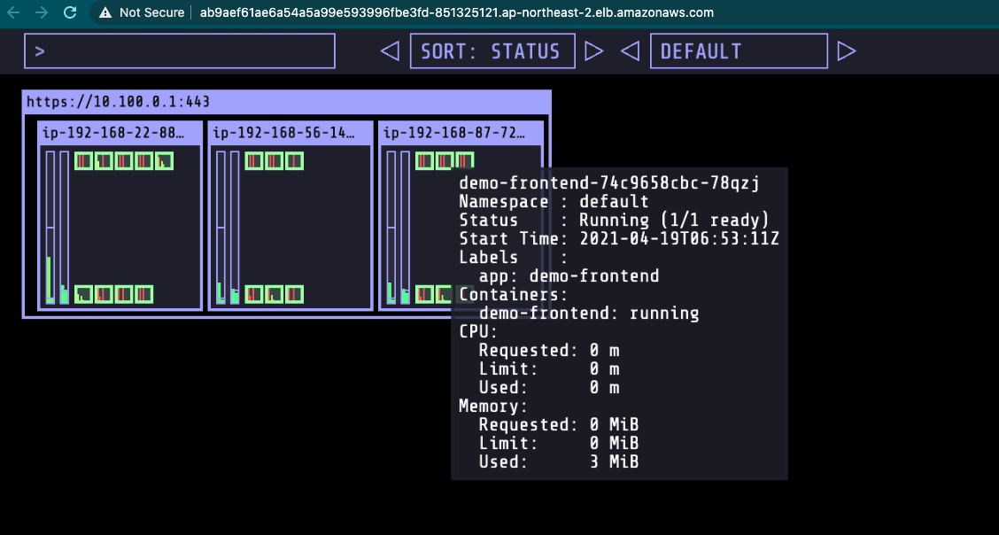

# (옵션) Kubernetes Operational View 설치하기

## Kubernetes Operational View 설치하기
[Kubernetes Operational View](https://codeberg.org/hjacobs/kube-ops-view) 는 여러 쿠버네티스 클러스터의 상태를 시각적으로 볼 수 있는 간단한 페이지입니다. 모니터링 및 운영 관리의 목적으로 사용되진 않으나 9-2 Cluster Autoscaler와 같이 클러스터 오토스케일링 작업 시, 스케일 인/아웃의 과정을 시각적으로 관찰할 수 있습니다.

본 실습에서는 Helm 을 통해, kube-ops-view를 배포합니다. Helm은 쿠버네티스 차트를 관리하기 위한 도구로 차트는 사전 구성된 쿠버네티스 리소스 패키지를 의미합니다. Helm으로 차트를 관리하는 목적은 다양한 manifest 파일들을 손쉽게 관리하기 위함입니다.

## Helm 구성

1. Helm을 구성하기 이전, helm cli 툴을 설치합니다.

```
curl https://raw.githubusercontent.com/helm/helm/master/scripts/get-helm-3 | bash
```

현재의 버전을 아래의 명령어를 통해 확인합니다.

```
helm version --short
```

2. 아래의 명령어를 통해, stable 저장소를 더해줍니다.

```
helm repo add stable https://charts.helm.sh/stable
```

그 다음 helm search repo stable 명령어를 통해, 차트 리스트들을 확인할 수 있습니다.

3. (옵션) helm 명령어를 위한 Bash completion을 구성합니다.

```
helm completion bash >> ~/.bash_completion
. /etc/profile.d/bash_completion.sh
. ~/.bash_completion
source <(helm completion bash)
```

## kube-ops-view 설치
아래의 명령어를 통해, helm을 통해 kube-ops-view를 설치합니다.

```
helm install kube-ops-view \
stable/kube-ops-view \
--set service.type=LoadBalancer \
--set rbac.create=True
```

차트가 성공적으로 설치되었는지 확인합니다.

```
helm list
```

아래의 결과 값에서 EXTERNAL-IP 항목에 있는 도메인 주소를 웹 브라우저에서 실행하면 현재 구축한 클러스터 상태를 파악할 수 있습니다.

```
kubectl get svc kube-ops-view
```



[Previous](./200-cluster-scaling.md) | [Next](../110-cicd/110-cicd.md)