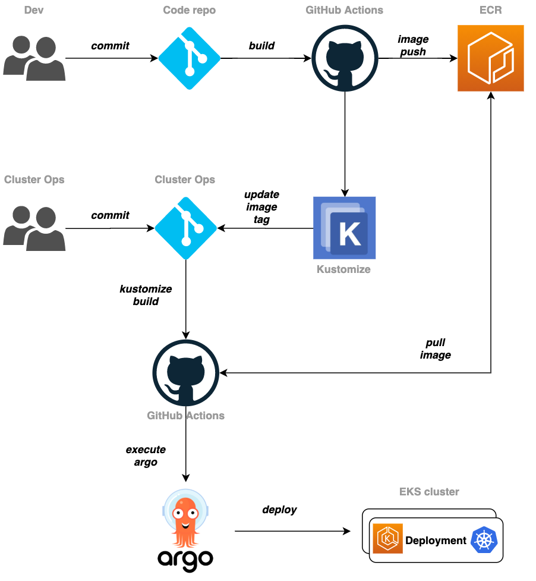

# CI/CD for EKS cluster

## EKS 클러스터,Kubernetes를 위한 CI/CD
EKS 또는 kubernetes 클러스터를 위한 CI/CD의 구성 형태는 다양 합니다. 왜냐하면 CI/CD를 구성 하는데 사용할 수 있는 관련 도구 들이 많기도 하며, 이를 활용하는 팀의 개발/운영 문화도 제각각 이기 때문 입니다.

이 튜토리얼에서 안내하는 CI/CD 구성 형태의 목표는 다음과 같습니다.

- 빠르게 사용할 수 있는 툴 이용

- 쉽게 사용할 수 있는 툴 이용

- 수작업 개입 보다는 자동화

이 목표에 따라 Github 에 위치한 application 소스와 k8s manifests 의 변경 사항이 발생될 때 마다 자동으로 Github Action 을 통해서 빌드/통합(Continous Integration) 하고, 통합된 배포 대상을 ArgoCD 를 통해 k8s 클러스터에 배포(Continous Deployment) 하는 일종의 gitops 파이프라인을 만드는 과정을 안내 합니다. 이 때 k8s manifests를 통합/패키징 하는 도구로 Kustomize를 사용 합니다. 더불어 컨테이너 이미지 및 kubernetes manifest 정적 분석을 위해 Checkov와 Trivy 를 함께 사용 합니다. 이를 통해 클러스터의 보안을 향상 할 수 있습니다.

- GitHub

- GitHub Actions

- Kustomize

- ArgoCD

- Checkov

- Trivy

완성된 CI/CD 파이프라인의 동작 흐름은 다음과 같습니다.

[Previous](../100-scaling/300-kube-ops-view.md) | [Next](./111-cicd.md)