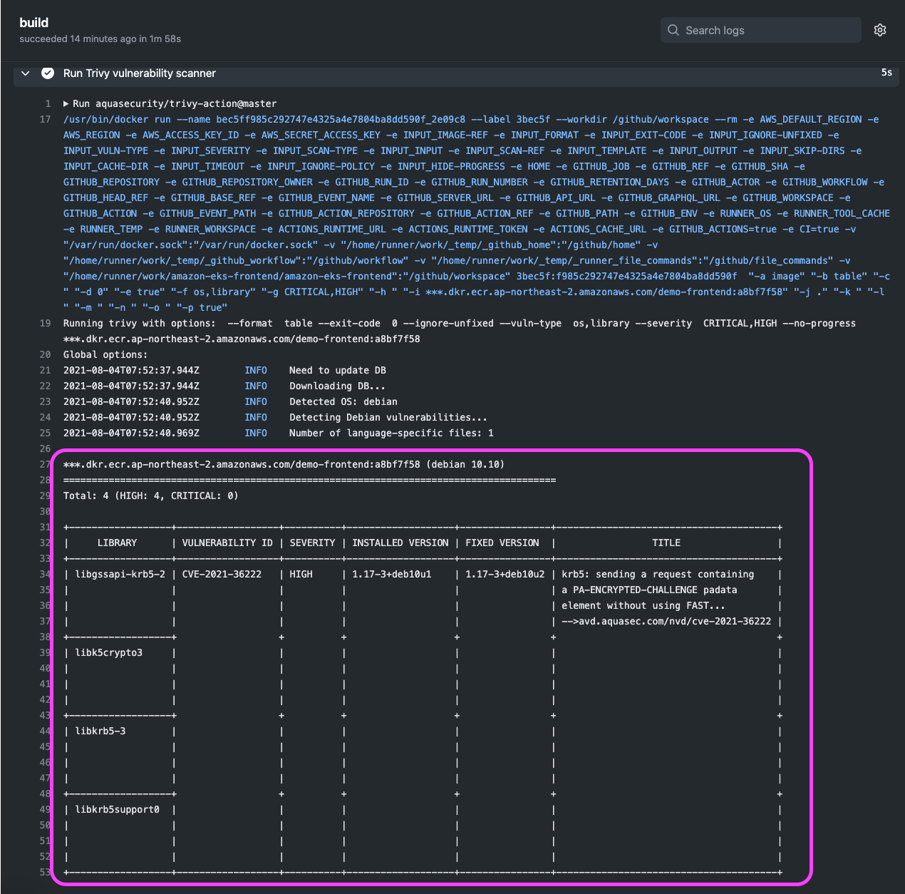
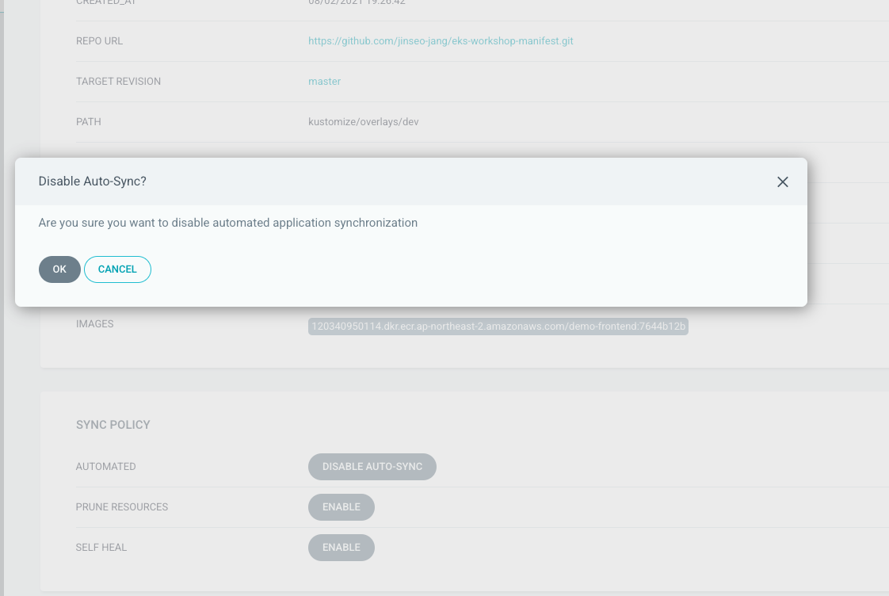
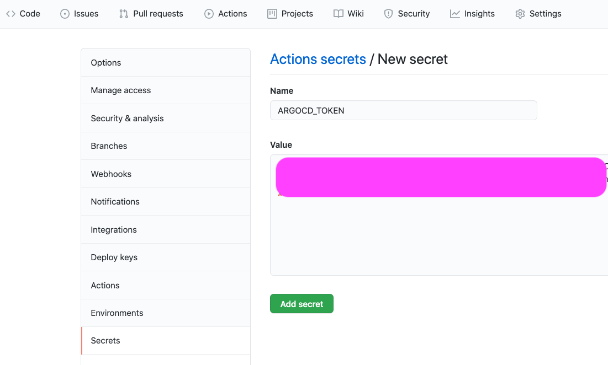
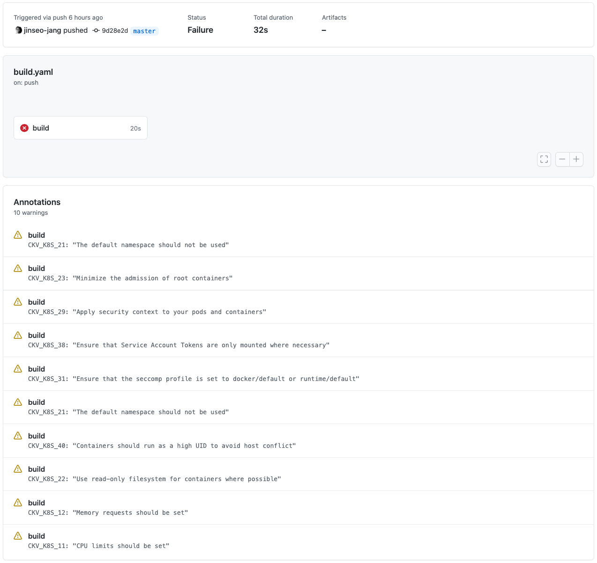

# CI/CD with security

## CI/CD 파이프라인에 정적 보안 분석 단계 추가 하기
k8s manifest 를 배포 하기 전에 Checkov 과 Trivy  를 이용하여 k8s manifest 및 container image 가 security, misconfiguration 문제가 없는지 검사하는 단계를 ci/cd 파이프라인에 추가 합니다. 더불어, 기존에 사용하던 ArgoCD admin과 분리된 CI/CD 전용의 별도 ArgoCD 계정을 생성합니다. 이는 ArgoCD RBAC 에 따라 설정 되어 ArgoCD 의 보안 향상을 도모 합니다.

이를 위해 변경 사항이 발생하면 곧바로 CD 작업이 시작 되던 기존 방식을 다음과 같이 변경 합니다.

1. application repo 변경 작업이 발생 되고 새로운 image tag 값과 함께 docker image 가 생성 된다

2. 새로운 docker image 에 보안 취약점이 없는지 Trivy 를 이용해 점검 한다

3. k8s manifest repo에 새로운 image tag 값이 commit 되면 kustomize 를 이용해 최종 k8s manifest를 생성 한다(kustomize build)

4. 생성된 최종 k8s manifests에 대해 Checkov 를 통해 정적 코드 분석 작업을 수행 한다

5. 분석 작업 결과에 문제가 없으면 ArgoCD application 의 Sync 작업을 시작 한다

각 단계가 수행 되는 repository는 다음과 같습니다.

- 1~2 : Application repository 의 github Action

- 3~5 : k8s manifest repository 의 github Action

이를 위한 이번 실습의 주요 작업 내용은 다음과 같습니다.

- frontend application repository github action build script 수정

- k8s manifest repository github action build script 생성

- ArgoCD AUTO_SYNC 비활성화 (Manual)

- ArgoCD 신규 account 생성

- ArgoCD 신규 account 에 대한 auth-token 생성

- Argocd 신규 account 애 대한 Argo RBAC 설정

---

1. frontend application repository github action build script 수정

새로운 Docker image 가 Build 되어 새로운 Image tag 와 함께 만들어지고 나며 컨테이너 이미지 보안 취약점 검사를 한 후, 문제가 없는 경우에만 ECR 에 저장 하도록 합니다. 이를 위해 기존 gitHub Action build.yaml 에 image scanning 과정을 추가 필요 합니다.

이번 실습에서는 Trivy  를 이용하여 image scanning 을 합니다.

frontend application repository 의 github action build.yaml 을 수정을 위해 아래 명령을 실행 합니다.

```
cd cd ~/environment/amazon-eks-frontend/.github/workflows
cat <<EOF> buid.yaml
name: Build Front

on:
  push:
    branches: [ main ]

jobs:
  build:
    runs-on: ubuntu-latest
    steps:
      - name: Checkout source code
        uses: actions/checkout@v2

      - name: Check Node v
        run: node -v

      - name: Build front
        run: |
          npm install
          npm run build

      - name: Configure AWS credentials
        uses: aws-actions/configure-aws-credentials@v1
        with:
          aws-access-key-id: \${{ secrets.AWS_ACCESS_KEY_ID }}
          aws-secret-access-key: \${{ secrets.AWS_SECRET_ACCESS_KEY }}
          aws-region: $AWS_REGION

      - name: Login to Amazon ECR
        id: login-ecr
        uses: aws-actions/amazon-ecr-login@v1

      - name: Get image tag(verion)
        id: image
        run: |
          VERSION=\$(echo \${{ github.sha }} | cut -c1-8)
          echo VERSION=\$VERSION
          echo "::set-output name=version::\$VERSION"

      - name: Build, tag, and push image to Amazon ECR
        id: image-info
        env:
          ECR_REGISTRY: \${{ steps.login-ecr.outputs.registry }}
          ECR_REPOSITORY: demo-frontend
          IMAGE_TAG: \${{ steps.image.outputs.version }}
        run: |
          echo "::set-output name=ecr_repository::\$ECR_REPOSITORY"
          echo "::set-output name=image_tag::\$IMAGE_TAG"
          docker build -t \$ECR_REGISTRY/\$ECR_REPOSITORY:\$IMAGE_TAG .

      - name: Run Trivy vulnerability scanner
        uses: aquasecurity/trivy-action@master
        with:
          image-ref: '\${{ steps.login-ecr.outputs.registry}}/\${{ steps.image-info.outputs.ecr_repository }}:\${{ steps.image-info.outputs.image_tag }}'
          format: 'table'
          exit-code: '0'
          ignore-unfixed: true
          vuln-type: 'os,library'
          severity: 'CRITICAL,HIGH'

      - name: Push image to Amazon ECR
        run: |
          docker push \${{ steps.login-ecr.outputs.registry}}/\${{ steps.image-info.outputs.ecr_repository }}:\${{ steps.image-info.outputs.image_tag }}

EOF
```

변경 된 코드를 repository에 push 합니다.

```
git add .
git commit -m "Add Image Scanning in build.yaml"
git push -u origin main
```

이어 github action job 이 수행 되며 아래와 같이 image scan 결과가 확인 됩니다.



image scan 결과 취약점이 발견 되었는데도 불구 하고 후속 작업이 진행 되었습니다. 이유는 실습을 위해 취약점이 발생 되더라도 성공 적인 종료가 되도록 했기 때문 입니다. 이에 대한 설정은 build.yaml 의 trivy 설정 부분의 exit-code: '0' 을 exit-code: '1'로 변경 하면 취약점 발견 시 job 이 중단 됩니다. 설정 값에 대한 자세한 내용은 Trivy doc  을 참고 하세요.

2. k8s manifest repository의 github action build script 생성

```
cd ~/environment/ks8-manifest-repo
mkdir -p ./.github/workflows
cat <<EOF> build.yaml
name: "ArgoCD sync"
on: "push"

jobs:
  build:
    runs-on: ubuntu-latest
    steps:

      - name: Checkout source code
        uses: actions/checkout@v2

      - name: Setup Kustomize
        uses: imranismail/setup-kustomize@v1

      - name: Build Kustomize
        run: |
          pwd
          mkdir kustomize-build
          kustomize build ./overlays/dev > ./kustomize-build/kustomize-build-output.yaml
          ls -rlt
          cd kustomize-build
          cat kustomize-build-output.yaml

      - name: Run Checkov action
        id: checkov
        uses: bridgecrewio/checkov-action@master
        with:
          directory: kustomize-build/
          framework: kubernetes

      - name: Install ArgoCD and execute Sync in ArgoCD
        run: |
          curl -sSL -o /usr/local/bin/argocd https://github.com/argoproj/argo-cd/releases/latest/download/argocd-linux-amd64
          chmod +x /usr/local/bin/argocd
          ARGO_SERVER=ab8aee80cfa7145e5a03ff7ea4cf6a72-239770354.ap-northeast-2.elb.amazonaws.com
          argocd app sync eksworkshop-cd-pipeline --auth-token ${{ secrets.ARGOCD_TOKEN }} --server $ARGO_SERVER --insecure

EOF
```

3. ArgoCD AUTO_SYNC 비활성화 (Manual)

Applicaiton > eksworkshop-cd-pipeline 으로 이동 하여 APP DETAILS 클릭 합니다. 이어 SYNC_POLICY 의 AUTOMATED 값을 DISABLE AUTO-SYNC 로 변경 합니다.



4. ArgoCD 신규 account 생성

k8s manifest repo 의 github action가 ArgoCD Sync 를 호출 하기 위해 사용할 새로운 ArgoCD account 를 생성 합니다. 기존 admin 과 별도로 생성 하여 별도의 role을 부여해 보안을 향상 합니다.

새로운 account 는 devops 입니다.

ArgoCD 의 account 추가는 ArgoCD의 Configmap을 통해서 가능합니다.

아래 명령을 실행 합니다.

```
kubectl -n argocd edit configmap argocd-cm -o yaml
```

그리고 다음을 추가 합니다.

```
data:
  accounts.devops: apiKey,login
```

최종 모습은 다음과 같아야 합니다. (* createTimestamp, resourceVersion 등의 값은 환경 마다 상이 합니다.)

```
apiVersion: v1
data:
  accounts.devops: apiKey,login
kind: ConfigMap
metadata:
  annotations:
    kubectl.kubernetes.io/last-applied-configuration: |
      {"apiVersion":"v1","kind":"ConfigMap","metadata":{"annotations":{},"labels":{"app.kubernetes.io/name":"argocd-cm","app.kubernetes.io/part-of":"argocd"},"name":"argocd-cm","namespace":"argocd"}}
  creationTimestamp: "2021-07-28T07:45:53Z"
  labels:
    app.kubernetes.io/name: argocd-cm
    app.kubernetes.io/part-of: argocd
  name: argocd-cm
  namespace: argocd
  resourceVersion: "153620981"
  selfLink: /api/v1/namespaces/argocd/configmaps/argocd-cm
  uid: a8bb80e7-577c-4f10-b3de-359e83ccee20
```

추가가 완료 되면 :wq! 을 입력하여 저장 하고 종료 합니다.

5. ArgoCD 신규 account 에 대한 auth-token 생성

새로운 ArgoCD account 인 devops 가 사용할 auth-token 을 생성 합니다. 이는 argocd api를 이용해 작업을 호출할 때 사용하는 인증 토큰 입니다. 즉 login password 와 별개의 값이 입니다.

아래 명령을 실행 하고 출력 되는 토큰 값을 따로 저장 해둡니다. 뒤이은 작업에서 사용합니다

```
argocd account generate-token --account devops
```

저장한 토큰 값을 k8s manifest repository에서 사용할 Secrets 으로 저장 합니다. repository 로 이동 한 다음 Settings > Secrets 순서로 이동 합니다. 그리고 우측 상단의 New repository secret을 클릭 합니다. Secrets 의 Name 은 ARGOCD_TOKEN 으로 입력 하고 Value는 저장한 토큰 값을 복사 하여 붙여 넣습니다. 그리고 Add Secret 을 클릭 합니다.



6. Argocd 신규 account 애 대한 Argo RBAC 설정

새로 생성한 ArgoCD account 는 Sync를 호출할 수 있는 permission 이 없습니다. 따라서 ArgoCD가 사용하는 RBAC 규칙에 맞게 새롭게 permission 을 할당해주어야 합니다.

ArgoCD RBAC 을 추가하려면 ArgoCD Confimap 인 argocd-rbac-cm 을 수정해야 합니다. 다음 명령을 실행 하여 수정을 시작 합니다.

```
kubectl -n argocd edit configmap argocd-rbac-cm -o yaml
```

아래 값을 추가 합니다. 실습을 위해 많은 권한을 부여 했습니다. 실제 운영 현장에서는 필요한 권한만을 추가 합니다.

```
data:
  policy.csv: |
    p, role:devops, applications, *, */*, allow
    p, role:devops, clusters, get, *, allow
    p, role:devops, repositories, get, *, allow
    p, role:devops, repositories, create, *, allow
    p, role:devops, repositories, update, *, allow
    p, role:devops, repositories, delete, *, allow
```

최종 모습은 다음과 같아야 합니다. (* createTimestamp, resourceVersion 등의 값은 환경 마다 상이 합니다.)

```
apiVersion: v1
data:
  policy.csv: |
    p, role:devops, applications, *, */*, allow
    p, role:devops, clusters, get, *, allow
    p, role:devops, repositories, get, *, allow
    p, role:devops, repositories, create, *, allow
    p, role:devops, repositories, update, *, allow
    p, role:devops, repositories, delete, *, allow

    g, devops, role:devops
  policy.default: role:readonly
kind: ConfigMap
metadata:
  annotations:
    kubectl.kubernetes.io/last-applied-configuration: |
      {"apiVersion":"v1","kind":"ConfigMap","metadata":{"annotations":{},"labels":{"app.kubernetes.io/name":"argocd-rbac-cm","app.kubernetes.io/part-of":"argocd"},"name":"argocd-rbac-cm","namespace":"argocd"}}
  creationTimestamp: "2021-07-28T07:45:53Z"
  labels:
    app.kubernetes.io/name: argocd-rbac-cm
    app.kubernetes.io/part-of: argocd
  name: argocd-rbac-cm
  namespace: argocd
  resourceVersion: "153629591"
  selfLink: /api/v1/namespaces/argocd/configmaps/argocd-rbac-cm
  uid: 1fe0d735-f3a0-4867-9357-7a9e766fef22
```

7. 새로운 변경 사항 작동 확인

변경된 코드를 commit/push 합니다.

```
cd ~/environment/k8s-manifest-repo
git add .
git commit -m "Add github action with ArgoCD"
git push -u origin main
```

소스 commit/push 이후 k8s manifest repo github action(build) > ArgoCD(deploy) 작업이 순서대로 동작 하는지 살펴 봅니다.

k8s manifest repository의 github Actions 빌드 과정에서 다음과 같이 에러가 발생 합니다. 이는 새롭게 추가된 Checkov 의 k8s manifest 정적 코드 분석 결과 입니다. 모범 사례 기반 현재 누락된 설정을 경고와 함께 표시 해줍니다.



Checkov 동작을 확인했으므로 실습을 위해 분석 대상을 줄여서 다시 수행 하겠습니다.

다음 명령을 실행하여 Checkov 분석 대상을 한 가지 만(CKV_K8S_17)으로 줄입니다.

```
cd ~/environment/ks8-manifest-repo
mkdir -p ./.github/workflows
cat <<EOF> build.yaml
name: "ArgoCD sync"
on: "push"

jobs:
  build:
    runs-on: ubuntu-latest
    steps:

      - name: Checkout source code
        uses: actions/checkout@v2

      - name: Setup Kustomize
        uses: imranismail/setup-kustomize@v1

      - name: Build Kustomize
        run: |
          pwd
          mkdir kustomize-build
          kustomize build ./overlays/dev > ./kustomize-build/kustomize-build-output.yaml
          ls -rlt
          cd kustomize-build
          cat kustomize-build-output.yaml

      - name: Run Checkov action
        id: checkov
        uses: bridgecrewio/checkov-action@master
        with:
          directory: kustomize-build/
          framework: kubernetes
          check: CKV_K8S_17

      - name: Install ArgoCD and execute Sync in ArgoCD
        run: |
          curl -sSL -o /usr/local/bin/argocd https://github.com/argoproj/argo-cd/releases/latest/download/argocd-linux-amd64
          chmod +x /usr/local/bin/argocd
          ARGO_SERVER=ab8aee80cfa7145e5a03ff7ea4cf6a72-239770354.ap-northeast-2.elb.amazonaws.com
          argocd app sync eksworkshop-cd-pipeline --auth-token ${{ secrets.ARGOCD_TOKEN }} --server $ARGO_SERVER --insecure

EOF
```

변경된 코드를 commit/push 합니다.

```
cd ~/environment/k8s-manifest-repo
git add .
git commit -m "Chage Checkov check scope"
git push -u origin main
```

소스 commit/push 이후 k8s manifest repo github action(build) > ArgoCD(deploy) 작업이 순서대로 동작 하는지 살펴 봅니다. 정상적으로 ArgoCD 작업 까지 완료 됩니다.

8. 파이프라인 동작 확인

실제로 frontend application 코드를 변경하여 앞서 만든 pipeline 전체 과정이 정상적으로 구동되는지 확인 합니다.

(1) frontend application 소스 코드 변경

Cloud9 으로 이동해, 좌측 폴더 구조에서 amazon-eks-frontend/src/ 로 이동하여 App.js 더블 클릭하여 파일을 오픈 합니다.

line 67의 값을 EKS DEMO Blog version 2 으로 변경 하고 저장 합니다. 저장은 ctrl+s 를 누릅니다.

```
  return (
    <div className={classes.root}>
      <AppBar position="static" style={{ background: '#2E3B55' }}>
        <Toolbar>
          <IconButton edge="start" className={classes.menuButton} color="inherit" aria-label="menu">
            <CloudIcon />
          </IconButton>
          <Typography
            variant="h6"
            align="center"
            className={classes.title}
          >
            EKS DEMO Blog version 2
          </Typography>
          {new Date().toLocaleTimeString()}
        </Toolbar>
      </AppBar>
      <br/>
```

(2) commit and push

변경 코드를 git repository 에 commit&push 합니다.

```
cd ~/environment/amazon-eks-frontend
git add .
git commit -m "Add new blog version 2"
git push -u origin main
```

소스 commit/push 이후 frontend application repo github action(build) > k8s manifest repo github action(build) > ArgoCD(deploy) 작업이 순서대로 동작 하는지 살펴 봅니다. 정상적으로 ArgoCD 작업 까지 완료 됩니다.

모두 완료 되면 아래 명령을 통해 얻은 샘플 애플리케이션 주소를 브라우저를 통해 접속 합니다.

```
echo http://$(kubectl get ingress/backend-ingress -o jsonpath='{.status.loadBalancer.ingress[*].hostname}')
```

새로운 변경 사항이 반영된 블로그가 EKS DEMO Blog version 2 라는 메인 타이틀과 함께 확인 됩니다.

[Previous](./100-cicd.md) | [Next](../900-cleanup/900-cleanup.md)