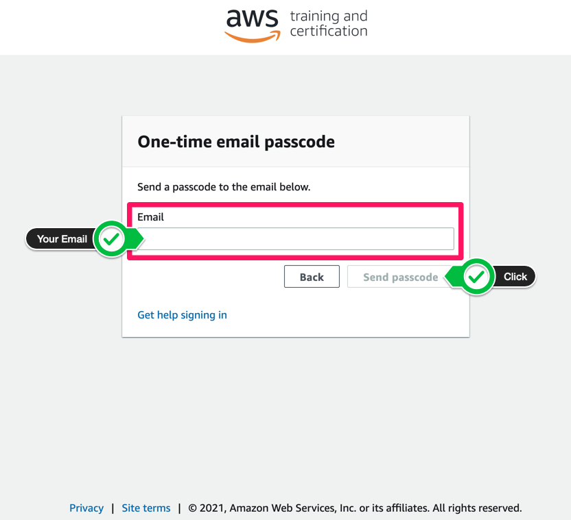
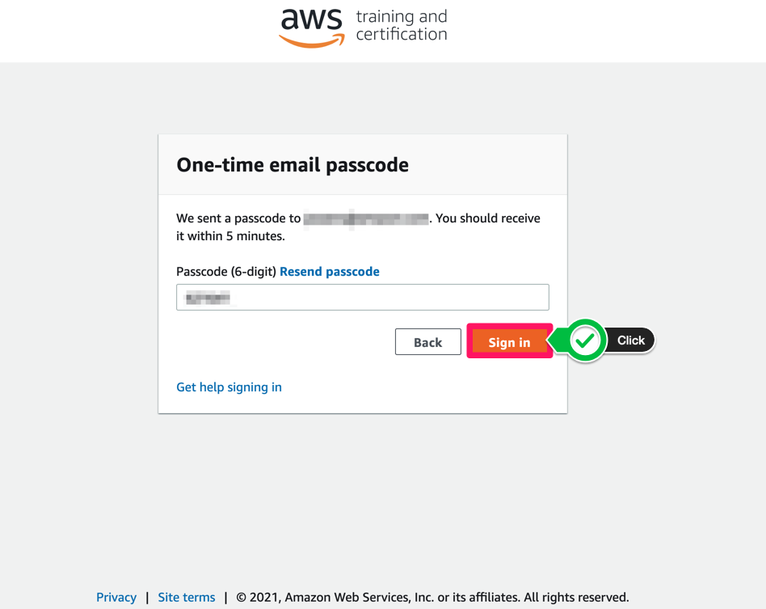

# AWS EventEngine으로 시작

## AWS Workshop Portal 로그인 하기

해당 페이지는 AWS가 주최하는 교육에 참석했을 때, 실습 시작 전 준비 단계를 가이드하는 페이지입니다.

AWS Wokshop Portal에 로그인하여 실습을 진행하실 경우, Team Hash 값이 필요합니다. 여기를 클릭 한 후, 이벤트 주최자로부터 받은 12자리 Participant Hash 값을 입력하면 오른쪽 하단 버튼이 Accept Terms & Login으로 변경됩니다. 다음 단계로 넘어가기 위해, 해당 버튼을 누릅니다.

Email One-Time Password (OTP) 버튼을 누릅니다.

본인의 이메일 계정을 작성하고 Send Code 버튼을 누릅니다.

작성한 이메일 수신함에서 제목이 Your one-time passcode 이메일을 확인하고 아래와 같은 passcode를 복사합니다.

복사한 passcode를 아래와 같이 붙여넣기 한 뒤, Sign in 버튼을 누릅니다.

다음 화면에서 AWS Console 버튼을 누르면 콘솔에 로그인할 수 있는 로그인 링크를 받을 수 있습니다.

Open AWS Console 버튼을 누르면 AWS Console 창으로 접속할 수 있습니다. 또한, CLI 환경을 위한 Access Key와 Secret Access Key도 확인할 수 있습니다.

위의 단계를 모두 수행했다면 실습을 시작할 수 있습니다.

[Previous](./100-account.md) | [Next](../30-setting/30-setting.md)