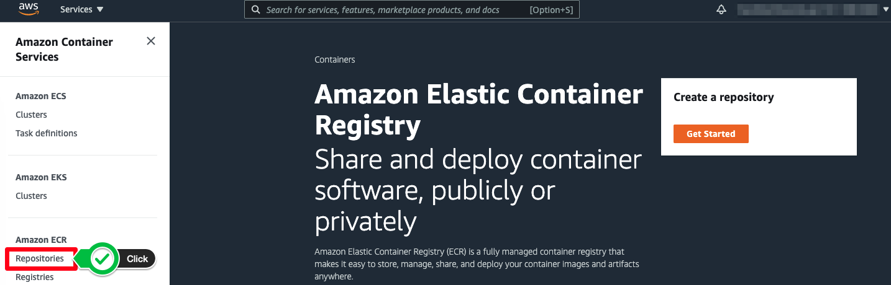
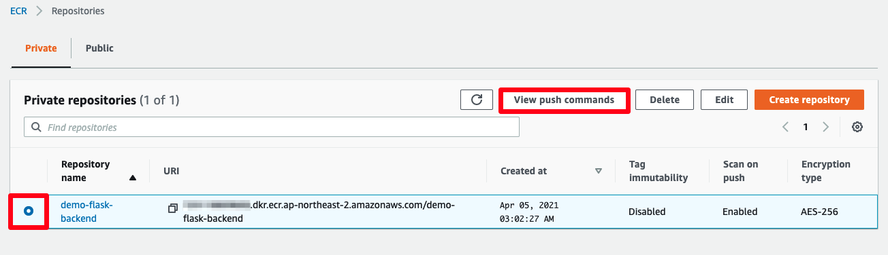
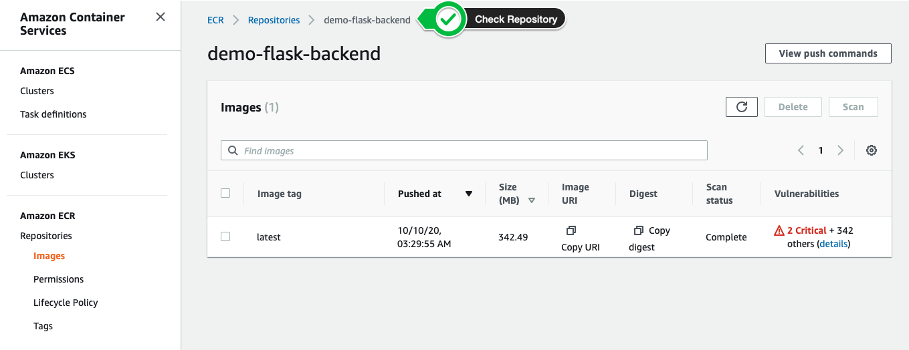

# Amazon ECR에 이미지 올리기

## Amazon ECR 리포지토리 생성 및 이미지 올리기
도커 컨테이너 레지스트리인 Amazon ECR(Elastic Container Registry) 에 리포지토리를 생성하고 컨테이너 이미지를 올리는 작업을 수행합니다.


[Amazon ECR](https://docs.aws.amazon.com/AmazonECR/latest/userguide/what-is-ecr.html) 은 이미지를 가용성과 확장성이 뛰어난 아키텍처에 호스팅하여 사용자는 애플리케이션을 위한 컨테이너를 안정적으로 배포할 수 있습니다. 또한, Amazon ECR을 사용함으로써 이미지 리포지토리를 직접 구축하고 관리할 필요가 없습니다. AWS IAM을 사용하여 컨테이너 이미지에 액세스할 수 있는 사용자 및 리소스에 대한 권한을 제어하고 모니터링할 수 있고, 이미지 취약점 스캔 기능도 활성화할 수 있습니다. 또한, 리포지토리를 프라이빗 혹은 퍼블릭으로 설정할 수 있습니다.

1. 아래의 명령어를 통해, 컨테이너라이징할 소스 코드를 다운 받습니다.

```
git clone https://github.com/joozero/amazon-eks-flask.git
```

2. AWS CLI를 통해, 이미지 리포지토리를 생성합니다. 본 실습에서는 리포지토리 이름을 demo-flask-backend라고 설정합니다. 또한, 리전 값에는 EKS 클러스터를 배포할 리전 코드(예: 
ap-northeast-2)를 명시합니다.

```
aws ecr create-repository \
--repository-name demo-flask-backend \
--image-scanning-configuration scanOnPush=true \
--region ${AWS_REGION}
```

해당 CLI를 입력하면 리포지토리에 대한 정보가 결과 값으로 도출됩니다. 또한, [Amazon ECR 콘솔창](https://console.aws.amazon.com/ecr/home) 에서도 생성된 리포지토리를 확인할 수 있습니다.



아래의 작업의 경우, 개인 계정 정보가 들어갑니다. Amazon ECR 콘솔창 에서 방금 생성한 리포지토리를 클릭 후, 우측 상단의 View push commands를 클릭하면 아래와 같은 가이드를 확인할 수 있습니다.




3. 컨테이너 이미지를 리포지토리에 푸쉬하기 위해, 인증 토큰을 가지고 오고, 해당 인증 도큰을 docker login 명령어로 전달합니다. 이 때, 사용자 이름 값은 AWS로 명시하고, 인증하려는 Amazon ECR 레지스트리 URI를 지정합니다.

```
aws ecr get-login-password --region ${AWS_REGION} | docker login --username AWS --password-stdin $ACCOUNT_ID.dkr.ecr.$AWS_REGION.amazonaws.com
```

[!] 위의 명령어가 제대로 작동하지 않을 시, 해당 터미널 창에서 ACCOUNT_ID 환경 변수가 호출되는지 확인합니다.

4. 1번에서 다운 받은 소스 코드 위치(예: /home/ec2-user/environment/amazon-eks-flask) 에 들어가 도커 이미지를 빌드하는 아래의 명령어를 입력합니다.

```
cd ~/environment/amazon-eks-flask

docker build -t demo-flask-backend .
```

5. 이미지가 빌드되면 docker tag 명령어를 통해, 해당 이미지가 특정 리포지토리에 푸쉬될 수 있도록 설정합니다.

```
docker tag demo-flask-backend:latest $ACCOUNT_ID.dkr.ecr.$AWS_REGION.amazonaws.com/demo-flask-backend:latest
```

6. docker push 명령어를 통해, 이미지를 리포지토리에 푸쉬합니다.

```
docker push $ACCOUNT_ID.dkr.ecr.$AWS_REGION.amazonaws.com/demo-flask-backend:latest
```

7. Amazon ECR 콘솔창에서 방금 생성한 리포지토리를 클릭하면 아래의 화면처럼 이미지가 올라온 것을 확인할 수 있습니다.



8. 현재까지 EKS 클러스터에 배포할 컨테이너 이미지를 생성하고 이를 리포지토리에 저장하였습니다.

[Previous](./100-build-image.md) | [Next](./50-eks-cluster/50-eks-cluster.md)