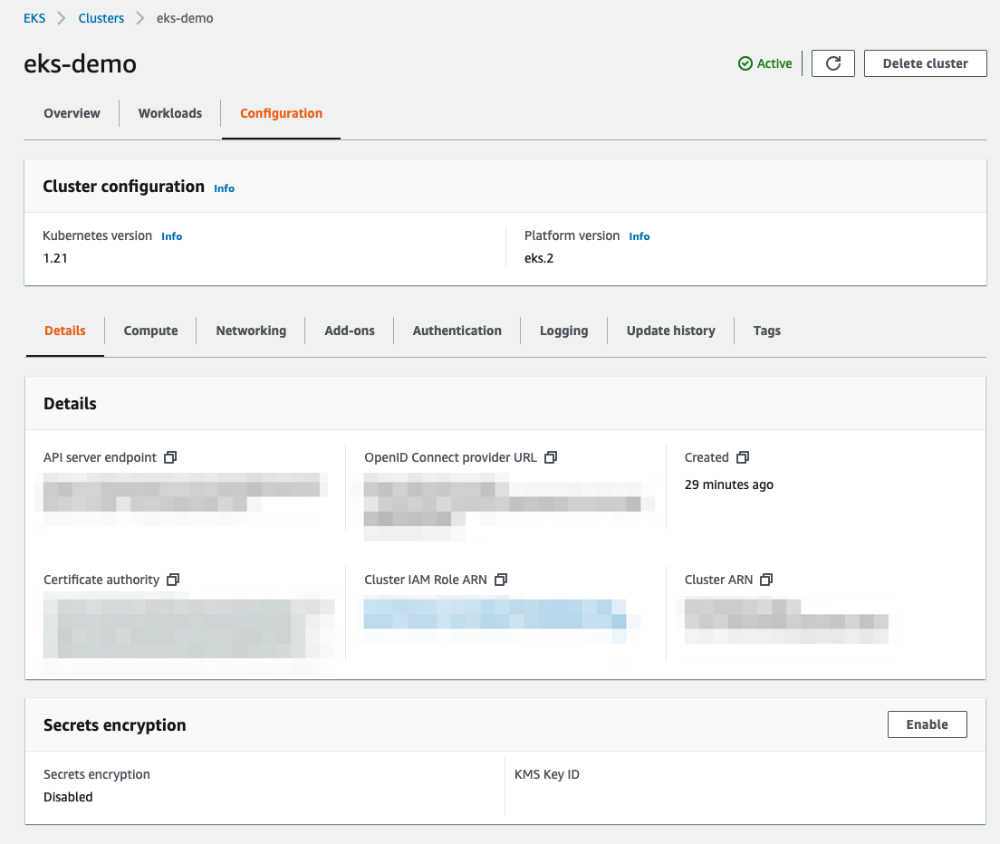

# (옵션) 콘솔 크레덴셜 더하기

## Console Credential 더하기
EKS 클러스터는 클러스터 접근 제어를 위해 IAM entity(사용자 또는 역할)를 사용합니다. 해당 rule은 aws-auth라는 ConfigMap에서 실행됩니다. 기본적으로 클러스터를 생성하는데 사용된 IAM entity에는 컨트롤 플레인에서 클러스터 RBAC 구성의 system:masters 권한이 자동적으로 부여됩니다.

현재 상태에서 Amazon EKS 콘솔창에 접속한다면 아래와 같이 어떤 정보도 확인할 수 없습니다.


5-1. [eksctl로 클러스터 생성하기](https://catalog.us-east-1.prod.workshops.aws/workshops/9c0aa9ab-90a9-44a6-abe1-8dff360ae428/ko-KR/50-eks-cluster/100-launch-cluster) 실습에서 Cloud9의 IAM credential을 통해, 클러스터를 생성하였기 때문에 Amazon EKS 콘솔창 에서 해당 클러스터 정보를 확인하기 위해서는 실제 콘솔에 접근할 IAM entity(사용자 또는 역할)의 AWS Console credential을 클러스터에 추가하는 작업이 필요합니다.

1. 아래의 명령어를 통해, role ARN(Amazon Resource Number)을 정의합니다.

```
rolearn=$(aws cloud9 describe-environment-memberships --environment-id=$C9_PID | jq -r '.memberships[].userArn')

echo ${rolearn}
```

[!] 해당 결과 값을 불렀을 때, assumed-role이 있다면 아래의 작업을 추가적으로 수행합니다.

```
assumedrolename=$(echo ${rolearn} | awk -F/ '{print $(NF-1)}')
rolearn=$(aws iam get-role --role-name ${assumedrolename} --query Role.Arn --output text) 
```

2. 아래의 명령어를 통해, identity 맵핑을 생성합니다.

```
eksctl create iamidentitymapping --cluster eks-demo --arn ${rolearn} --group system:masters --username admin
```

3. 아래의 명령어를 통해, 관련 정보를 확인할 수 있습니다.

```
kubectl describe configmap -n kube-system aws-auth
```

4. 위의 작업이 완료되면 콘솔창에서 컨트롤 플레인 단의 정보 및 워커 노드 정보, 로깅 활성화 정보, 업데이트 정보 등을 파악할 수 있습니다.


Workloads 탭에서 쿠버네티스 안에 있는 애플리케이션들을 확인할 수 있습니다.


Configuration 탭에서 클러스터의 구성 정보를 확인할 수 있습니다.



[Previous](./100-launch-cluster.md) | [Next](../60-ingress-controller/60-ingress-controller.md)