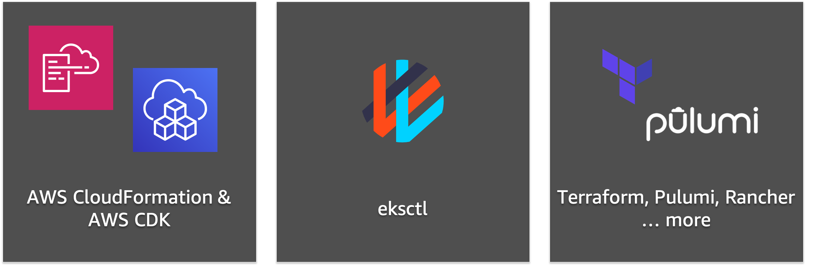

# EKS 클러스터 생성하기
Amazon EKS 클러스터는 다양한 방식으로 배포될 수 있습니다.

- [AWS 콘솔 창](https://console.aws.amazon.com/eks/home#/) 에서 클릭으로 배포하는 방법

- [AWS CloudFormation] 혹은 [AWS CDK](https://docs.aws.amazon.com/cdk/api/latest/) 와 같은 IaC(Infrastructure as Code) 도구를 사용해 배포하는 방법

- EKS의 공식 CLI인 [eksctl](https://eksctl.io/) 로 배포하는 방법

- Terraform, Pulumi, Rancher 등으로 배포하는 방법

본 실습에서는 eksctl을 사용하여 EKS 클러스터를 생성합니다.

[Previous](../40-container/200-eks.md) | [Next](./100-launch-cluster.md)