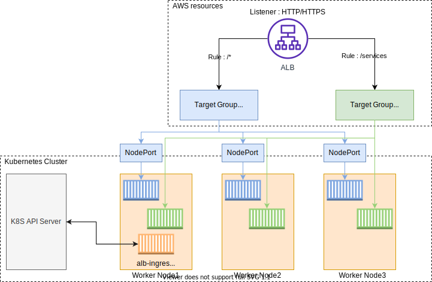

# AWS Load Balancer 컨트롤러 만들기

## AWS Load Balancer 컨트롤러 만들기
[Amazon EKS의 Application Load Balancing](https://docs.aws.amazon.com/eks/latest/userguide/alb-ingress.html) 이란 클러스터에 인그레스 자원이 생성될 때에 ALB(Application Load Balancer) 및 필요한 자원이 생성되도록 트리거하는 컨트롤러입니다. 인그레스 자원들은 ALB를 구성하여 HTTP 또는 HTTPS 트래픽을 클러스터 내 파드로 라우팅합니다.

- 쿠버네티스의 Ingress의 경우, Application Load Balancers으로 프로비저닝됩니다.

- 쿠버네티스의 Service의 경우, Network Load Balancers으로 프로비저닝됩니다.

AWS Load Balancer 컨트롤러에서 지원하는 트래픽 모드는 아래의 두 가지입니다.

- Instance(default): 클러스터 내 노드를 ALB의 대상으로 등록합니다. ALB에 도달하는 트래픽은 NodePort로 라우팅된 다음 파드로 프록시됩니다.

- IP: 파드를 ALB 대상으로 등록합니다. ALB에 도달하는 트래픽은 파드로 직접 라우팅됩니다. 해당 트래픽 모드를 사용하기 위해선 ingress.yaml 파일에 주석을 사용하여 명시적으로 지정해야 합니다.



먼저, 앞으로의 매니페스트를 관리하기 위해 루트 폴더(예: /home/ec2-user/environment/)에서 manifests라는 이름을 가진 폴더를 생성합니다. 그 후, manifests 폴더 안에서, ALB 인그레스 컨트롤러 관련 매니페스트를 관리하기 위한 폴더 alb-ingress-controller를 만듭니다.

```
cd ~/environment

mkdir -p manifests/alb-ingress-controller && cd manifests/alb-ingress-controller

# 최종 폴더 위치
/home/ec2-user/environment/manifests/alb-ingress-controller
```

AWS Load Balancer 컨트롤러를 배포하기 전, 우리는 몇 가지 작업을 수행해야 합니다. controller가 워커 노드 위에서 동작되기 때문에 IAM permissions를 통해, AWS ALB/NLB 리소스에 접근할 수 있도록 만들어야 합니다. IAM permissions는 ServiceAccount를 위한 IAM roles를 설치하거나 워커 노드의 IAM roles에 직접적으로 붙일 수 있습니다.

1. AWS Load Balancer 컨트롤러를 배포하기 전, 클러스터에 대한 IAM OIDC(OpenID Connect) identity Provider를 생성합니다. 쿠버네티스가 직접 관리하는 사용자 계정을 의미하는 service account에 IAM role을 사용하기 위해, 생성한 클러스터(현재 실습에서의 eks-demo)에 IAM OIDC provider가 존재해야 합니다.

```
eksctl utils associate-iam-oidc-provider \
    --region ${AWS_REGION} \
    --cluster eks-demo \
    --approve
```

[!] 여기서 잠깐 조금 더 알아보고 가요

- 생성한 IAM OIDC 자격 증명 공급자는 IAM 콘솔 Identity providers 메뉴 혹은 아래의 명령어를 통해 확인할 수 있습니다.

- 먼저, 클러스터의 OIDC provider URL을 아래의 명령어들을 통해 확인합니다.

```
aws eks describe-cluster --name eks-demo --query "cluster.identity.oidc.issuer" --output text
```

명령어 결과 나오는 값은 아래와 같은 형식을 가지고 있습니다.

```
https://oidc.eks.ap-northeast-2.amazonaws.com/id/8A6E78112D7F1C4DC352B1B511DD13CF
```

- 위의 결과 값에서 /id/ 뒤에 있는 값을 복사한 후, 아래와 같이 명령어를 수행합니다.

```
aws iam list-open-id-connect-providers | grep 8A6E78112D7F1C4DC352B1B511DD13CF
```

- 결과 값이 출력되면 IAM OIDC identity provider가 클러스터에 생성이 된 것이고, 아무 값도 나타나지 않으면 생성 작업을 수행해야 합니다.

2. AWS Load Balancer Controller에 부여할 IAM Policy를 생성하는 작업을 수행합니다.

```
aws iam create-policy \
    --policy-name AWSLoadBalancerControllerIAMPolicy \
    --policy-document https://raw.githubusercontent.com/kubernetes-sigs/aws-load-balancer-controller/v2.4.1/docs/install/iam_policy.json
```

3. AWS Load Balancer Controller를 위한 ServiceAccount를 생성합니다.

```
eksctl create iamserviceaccount \
    --cluster eks-demo \
    --namespace kube-system \
    --name aws-load-balancer-controller \
    --attach-policy-arn arn:aws:iam::$ACCOUNT_ID:policy/AWSLoadBalancerControllerIAMPolicy \
    --override-existing-serviceaccounts \
    --approve
```

EKS 클러스터를 배포할 때, AWS Load Balancer Controller와 관련된 IAM policy를 Addon 형태로 워커 노드에 추가하는 방법도 있습니다. 하지만 본 실습에서는 [여기](https://kubernetes-sigs.github.io/aws-load-balancer-controller/latest/deploy/installation/) 의 자료를 참고하여 진행합니다.

또한, IAM roles for service accounts([IRSA](https://aws.amazon.com/blogs/opensource/introducing-fine-grained-iam-roles-service-accounts/)) 관련 간단한 실습은 여기 의 자료를 참고하여 진행합니다.

1. AWS Load Balancer controller를 클러스터에 추가하는 작업을 수행합니다. 먼저, 인증서 구성을 웹훅에 삽입할 수 있도록 cert-manager 를 설치합니다. Cert-manager는 쿠버네티스 클러스터 내에서 TLS인증서를 자동으로 프로비저닝 및 관리하는 오픈 소스입니다.

```
kubectl apply --validate=false -f https://github.com/jetstack/cert-manager/releases/download/v1.5.3/cert-manager.yaml
```

2. Load balancer controller yaml 파일을 다운로드 합니다.

```
wget https://github.com/kubernetes-sigs/aws-load-balancer-controller/releases/download/v2.4.1/v2_4_1_full.yaml
```

3. yaml 파일에서 클러스터의 cluster-name을 편집합니다. 본 실습에서는 eks-demo로 설정합니다.

```
spec:
    containers:
    - args:
        - --cluster-name=eks-demo # 생성한 클러스터 이름을 입력
        - --ingress-class=alb
        image: amazon/aws-alb-ingress-controller:v2.4.1
```

그리고 yaml 파일에서 ServiceAccount yaml spec을 없애줍니다. AWS Load Balancer Controller를 위한 ServiceAccount를 이미 생성했기 때문입니다. 아래의 내용을 삭제한 후, yaml 파일을 저장합니다.

```
---
apiVersion: v1
kind: ServiceAccount
metadata:
  labels:
    app.kubernetes.io/component: controller
    app.kubernetes.io/name: aws-load-balancer-controller
  name: aws-load-balancer-controller
  namespace: kube-system
```

위의 yaml 파일에서 --cluster-name=eks-demo로 값을 변경했는지 꼭! 다시 한번 체크해주세요.

4. AWS Load Balancer controller 파일을 배포합니다.

```
kubectl apply -f v2_4_1_full.yaml
```

2. 배포가 성공적으로 되고 컨트롤러가 실행되는지 아래의 명령어를 통해 확인합니다. 결과 값이 도출되면 정상임을 의미합니다.

```
kubectl get deployment -n kube-system aws-load-balancer-controller
```

또한, 아래의 명령어를 통해, service account가 생성된 것을 확인할 수 있습니다.

```
kubectl get sa aws-load-balancer-controller -n kube-system -o yaml
```

클러스터 내부에서 필요한 기능들을 위해 실행되는 파드들을 애드온(Addon) 이라고 합니다. 애드온에 사용되는 파드들은 디플로이먼트, 리플리케이션 컨트롤러 등에 의해 관리됩니다. 그리고 이 애드온이 사용하는 네임스페이스가 kube-system입니다. Yaml 파일에서 네임스페이스를 kube-system으로 명시했기에 위의 명령어로 파드 이름이 도출되면 정상적으로 배포된 것입니다. 또한, 아래의 명령어로 관련 로그를 확인할 수 있습니다.

```
kubectl logs -n kube-system $(kubectl get po -n kube-system | egrep -o "aws-load-balancer[a-zA-Z0-9-]+")
```

아래의 명령어로 자세한 속성 값을 파악할 수 있습니다.

```
ALBPOD=$(kubectl get pod -n kube-system | egrep -o "aws-load-balancer[a-zA-Z0-9-]+")

kubectl describe pod -n kube-system ${ALBPOD}
```

[Previous](./60-ingress-controller.md) | [Next](../70-deploy-service/70-deploy-service.md)
