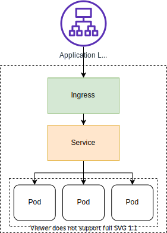

# 인그레스 컨트롤러 만들기

## 인그레스 컨트롤러(Ingress Controller)에 대하여
본 실습에서는 [AWS Load Balancer Controller](https://kubernetes-sigs.github.io/aws-load-balancer-controller/latest/) 를 사용하여 진행합니다.

AWS Load Balancer Controller는 구 AWS ALB Ingress Controller에서 리브랜드된 개념입니다.

인그레스(Ingress) 는 주로 클러스터 외부에서 쿠버네티스 내부로 접근할 때, 요청들을 어떻게 처리할지 정의해놓은 규칙이자 리소스 오브젝트입니다. 한마디로 외부의 요청이 내부로 접근하기 위한 관문의 역할을 하는 것이죠. 외부 요청에 대한 로드 밸런싱, TLS/SSL 인증서 처리, HTTP 경로에 대한 라우팅 등을 설정할 수 있습니다. 인그레스는 L7 영역의 요청을 처리합니다.

쿠버네티스에서 서비스 타입 중, NodePort 혹은 LoadBalancer로도 외부로 노출할 수 있지만 인그레스 없이 서비스를 사용할 경우, 모든 서비스에게 라우팅 규칙 및 TLS/SSL 등의 상세한 옵션들을 적용해야 되죠. 그래서 인그레스가 필요합니다.

인그레스는 외부 요청 처리에 대한 규칙들을 설정해놓은 것을 의미하며, 이런 설정이 동작하기 위해서 필요한 것이 인그레스 컨트롤러입니다. kube-controller-manager의 일부로 실행되는 다른 컨트롤러와 달리 인그레스 컨트롤러는 클러스터와 함께 생성되진 않습니다. 따라서 직접 구현해야 합니다.

[Previous](../50-eks-cluster/200-option-console.md) | [Next](./100-launch-alb.md)