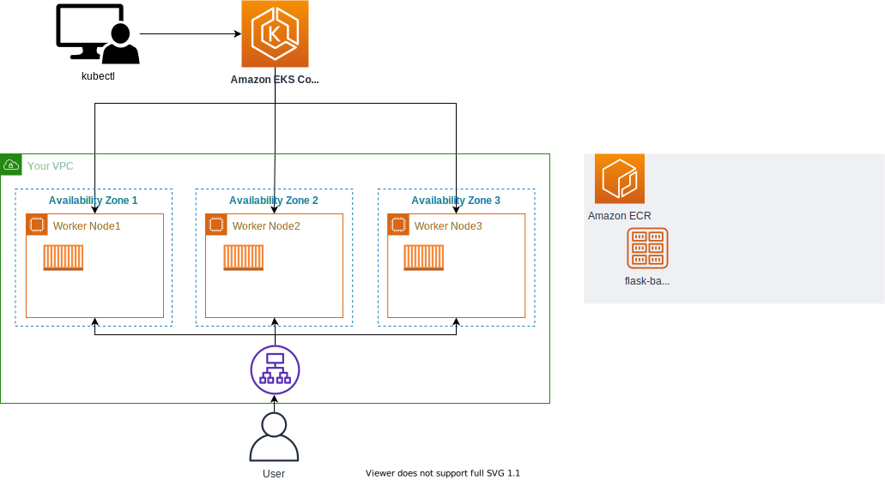

# 첫번째 백앤드 배포하기

## flask 백앤드 배포하기
본 실습을 진행하기 위해 4-2 Amazon ECR에 이미지 올리기 실습 부분이 선행되어야 합니다.

1. manifests 폴더 위치(/home/ec2-user/environment/manifests)로 이동합니다.

```
cd ~/environment/manifests/
```

2. 다음 명령어를 수행하여 deploy manifest를 생성합니다.

```
cat <<EOF> flask-deployment.yaml
---
apiVersion: apps/v1
kind: Deployment
metadata:
  name: demo-flask-backend
  namespace: default
spec:
  replicas: 3
  selector:
    matchLabels:
      app: demo-flask-backend
  template:
    metadata:
      labels:
        app: demo-flask-backend
    spec:
      containers:
        - name: demo-flask-backend
          image: $ACCOUNT_ID.dkr.ecr.$AWS_REGION.amazonaws.com/demo-flask-backend:latest
          imagePullPolicy: Always
          ports:
            - containerPort: 8080
EOF
```

3. 그 다음 service manifest 파일을 생성하기 위해 아래의 값을 붙여 넣습니다.

```
cat <<EOF> flask-service.yaml
---
apiVersion: v1
kind: Service
metadata:
  name: demo-flask-backend
  annotations:
    alb.ingress.kubernetes.io/healthcheck-path: "/contents/aws"
spec:
  selector:
    app: demo-flask-backend
  type: NodePort
  ports:
    - port: 8080 # 서비스가 생성할 포트  
      targetPort: 8080 # 서비스가 접근할 pod의 포트
      protocol: TCP
EOF
```

4. 마지막으로 ingress manifest 파일을 생성하기 위해 아래의 값을 붙여 넣습니다.

```
cat <<EOF> ingress.yaml
---
apiVersion: networking.k8s.io/v1
kind: Ingress
metadata:
    name: "backend-ingress"
    namespace: default
    annotations:
      kubernetes.io/ingress.class: alb
      alb.ingress.kubernetes.io/scheme: internet-facing
      alb.ingress.kubernetes.io/target-type: ip
spec:
    rules:
    - http:
        paths:
          - path: /contents
            pathType: Prefix
            backend:
              service:
                name: "demo-flask-backend"
                port:
                  number: 8080
EOF
```

5. 위에서 생성한 매니페스트를 아래의 순서대로 배포합니다. Ingress를 생성하면 AWS Application Load Balancer(ALB)가 프로비저닝됩니다.

```
kubectl apply -f flask-deployment.yaml
kubectl apply -f flask-service.yaml
kubectl apply -f ingress.yaml
```

6. 다음 명령어 수행 결과를 웹 브라우저 및 API 플랫폼에 붙여넣어 확인합니다.

```
echo http://$(kubectl get ingress/backend-ingress -o jsonpath='{.status.loadBalancer.ingress[*].hostname}')/contents/aws
```

인그레스 오브젝트가 배포되는 동안 약간의 시간이 소요됩니다. [EC2 콘솔창](https://ap-northeast-2.console.aws.amazon.com/ec2/v2/home?region=ap-northeast-2#LoadBalancers:) 에서 Load Balancers 상태가 active가 될 때까지 기다립니다.
현재까지의 아키텍처는 아래와 같습니다.



[Previous](./70-deploy-service.md) | [Next](./200-nodejs-backend)