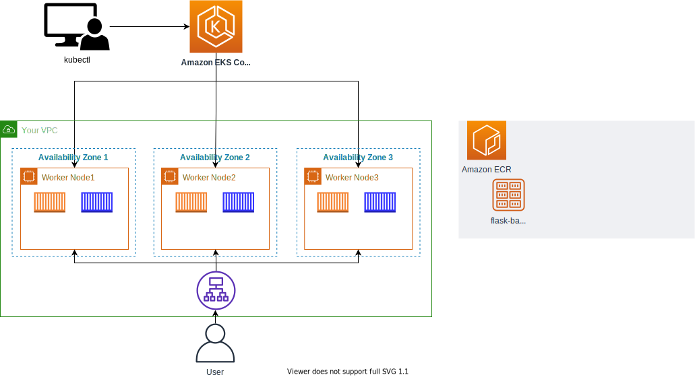

# 두번째 백앤드 배포하기

## express 백앤드 배포하기
flask 백앤드와 같은 순서로 express 백앤드도 배포합니다.

아래의 실습은 Amazon ECR에 이미지 올리기에서 진행한 이미지 빌드 및 리포지토리 푸쉬 과정을 생략하고 진행하기 위해, 이미 생성된 컨테이너 이미지를 배포합니다.

1. manifests 폴더 (/home/ec2-user/environment/manifests)로 이동하여 아래의 값을 붙여넣습니다.

```
cd ~/environment/manifests/
```

이미 만들어진 컨테이너 이미지를 포함한 deploy manifest를 생성합니다.

```
cat <<EOF> nodejs-deployment.yaml
---
apiVersion: apps/v1
kind: Deployment
metadata:
  name: demo-nodejs-backend
  namespace: default
spec:
  replicas: 3
  selector:
    matchLabels:
      app: demo-nodejs-backend
  template:
    metadata:
      labels:
        app: demo-nodejs-backend
    spec:
      containers:
        - name: demo-nodejs-backend
          image: public.ecr.aws/y7c9e1d2/joozero-repo:latest
          imagePullPolicy: Always
          ports:
            - containerPort: 3000
EOF
```

그 다음 service manifest 파일을 생성하기 위해 아래의 값을 붙여 넣습니다.

```
cat <<EOF> nodejs-service.yaml
---
apiVersion: v1
kind: Service
metadata:
  name: demo-nodejs-backend
  annotations:
    alb.ingress.kubernetes.io/healthcheck-path: "/services/all"
spec:
  selector:
    app: demo-nodejs-backend
  type: NodePort
  ports:
    - port: 8080
      targetPort: 3000
      protocol: TCP
EOF
```

[!] 인그레스 매니페스트 파일은 [첫 번째 백앤드 배포하기](https://catalog.us-east-1.prod.workshops.aws/workshops/9c0aa9ab-90a9-44a6-abe1-8dff360ae428/ko-KR/70-deploy-service/100-flask-backend)에 있는 파일을 수정합니다. 아래의 파일에서 demo-nodejs-backend의 경로가 추가되었음을 확인할 수 있습니다.

```
cat <<EOF> ingress.yaml
---
apiVersion: networking.k8s.io/v1
kind: Ingress
metadata:
  name: "backend-ingress"
  namespace: default
  annotations:
    kubernetes.io/ingress.class: alb
    alb.ingress.kubernetes.io/scheme: internet-facing
    alb.ingress.kubernetes.io/target-type: ip
spec:
  rules:
  - http:
        paths:
          - path: /contents
            pathType: Prefix
            backend:
              service:
                name: "demo-flask-backend"
                port:
                  number: 8080
          - path: /services
            pathType: Prefix
            backend:
              service:
                name: "demo-nodejs-backend"
                port:
                  number: 8080
EOF
```

2. 매니페스트를 배포합니다.

```
kubectl apply -f nodejs-deployment.yaml
kubectl apply -f nodejs-service.yaml
kubectl apply -f ingress.yaml
```

3. 다음 명령어 수행 결과를 웹 브라우저 및 API 플랫폼에 붙여넣어 확인합니다.

```
echo http://$(kubectl get ingress/backend-ingress -o jsonpath='{.status.loadBalancer.ingress[*].hostname}')/services/all
```

현재까지의 아키텍처는 아래와 같습니다.



[Previous](./100-flask-backend.md) | [Next](./300-frontend.md)
