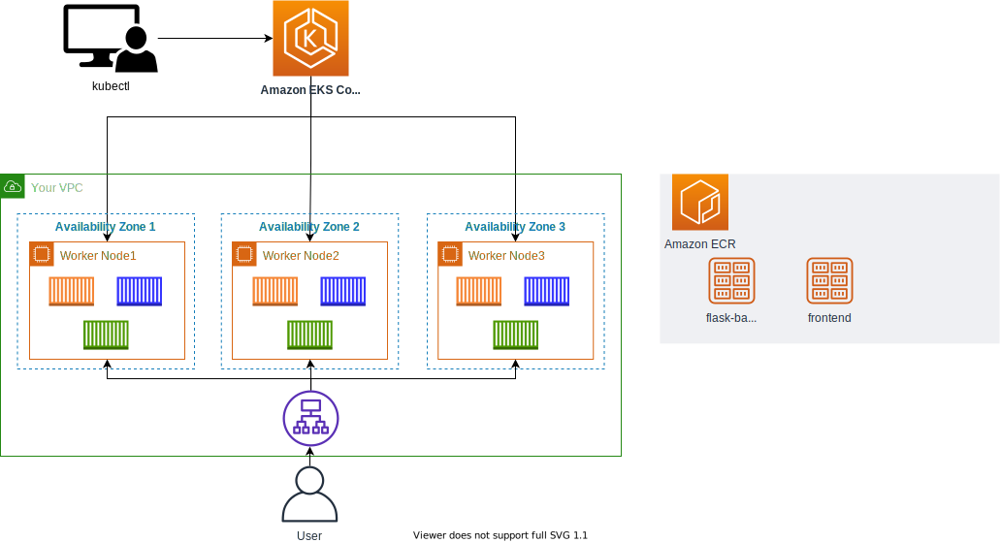

# 프론트앤드 배포하기

## React 프론트앤드 배포하기
두 개의 백앤드를 배포했다면 이제는 웹 페이지의 화면을 구성할 프론트앤드를 배포합니다.

1. 아래의 명령어를 통해, 컨테이너라이징할 소스 코드를 다운 받습니다.

```
cd /home/ec2-user/environment
git clone https://github.com/joozero/amazon-eks-frontend.git
```

2. AWS CLI를 통해, 이미지 리포지토리를 생성합니다. 본 실습에서는 리포지토리 이름을 demo-frontend라고 설정합니다.

```
aws ecr create-repository \
--repository-name demo-frontend \
--image-scanning-configuration scanOnPush=true \
--region ${AWS_REGION}
```

3. 두 개의 백앤드 결과 값을 화면에 뿌리기 위해, 일부 소스 코드를 수정합니다. 프론트앤드 소스 코드가 담긴 폴더(예: /home/ec2-user/environment/amazon-eks-frontend/src)에서 App.js 파일과 page/UpperPage.js 파일 에 있는 url 값을 앞서 배포한 인그레스 주소로 변경합니다.


위의 화면에서는 아래의 결과값(인그레스 주소)을 통해 도출된 값을 붙여넣습니다.

```
echo http://$(kubectl get ingress/backend-ingress -o jsonpath='{.status.loadBalancer.ingress[*].hostname}')/contents/'${search}'
```


위의 화면에서는 아래의 결과값을 통해 도출된 값을 붙여넣습니다.

```
echo http://$(kubectl get ingress/backend-ingress -o jsonpath='{.status.loadBalancer.ingress[*].hostname}')/services/all
```

4. amazon-eks-frontend 폴더에서 아래의 명령어를 수행합니다.

```
cd /home/ec2-user/environment/amazon-eks-frontend
npm install
npm run build
```

[!] npm install 이후, severity vulnerability가 나오는 경우 npm audit fix 명령어를 수행한 후, npm run build를 적용합니다.

5. Amazon ECR에 이미지 올리기 가이드를 참고하여 이미지 리포지토리 생성 및 이미지 푸시 단계를 진행합니다. 본 실습에서는 이미지 리포지토리 이름을 demo-frontend로 설정합니다.

```
docker build -t demo-frontend .

docker tag demo-frontend:latest $ACCOUNT_ID.dkr.ecr.$AWS_REGION.amazonaws.com/demo-frontend:latest
```

```
docker push $ACCOUNT_ID.dkr.ecr.$AWS_REGION.amazonaws.com/demo-frontend:latest
```

[!] 만약 바로 위의 명령어를 수행하는 동안, denied: Your authorization token has expired. Reauthenticate and try again. 메세지를 받는다면 아래의 명령어를 실행한 후, 다시 위의 명령어를 수행합니다.

```
aws ecr get-login-password --region $AWS_REGION | docker login --username AWS --password-stdin $ACCOUNT_ID.dkr.ecr.$AWS_REGION.amazonaws.com
```

6. manifests 폴더 (/home/ec2-user/environment/manifests)로 이동하여 아래의 값을 붙여넣습니다. 이 때, 이미지 값에는 demo-frontend 리포지토리 URI 값을 넣습니다.

```
cd /home/ec2-user/environment/manifests

cat <<EOF> frontend-deployment.yaml
---
apiVersion: apps/v1
kind: Deployment
metadata:
  name: demo-frontend
  namespace: default
spec:
  replicas: 3
  selector:
    matchLabels:
      app: demo-frontend
  template:
    metadata:
      labels:
        app: demo-frontend
    spec:
      containers:
        - name: demo-frontend
          image: $ACCOUNT_ID.dkr.ecr.$AWS_REGION.amazonaws.com/demo-frontend:latest
          imagePullPolicy: Always
          ports:
            - containerPort: 80
EOF
```

```
cat <<EOF> frontend-service.yaml
---
apiVersion: v1
kind: Service
metadata:
  name: demo-frontend
  annotations:
    alb.ingress.kubernetes.io/healthcheck-path: "/"
spec:
  selector:
    app: demo-frontend
  type: NodePort
  ports:
    - protocol: TCP
      port: 80
      targetPort: 80
EOF
```

```
cat <<EOF> ingress.yaml
---
apiVersion: networking.k8s.io/v1
kind: Ingress
metadata:
  name: "backend-ingress"
  namespace: default
  annotations:
    kubernetes.io/ingress.class: alb
    alb.ingress.kubernetes.io/scheme: internet-facing
    alb.ingress.kubernetes.io/target-type: ip
spec:
  rules:
    - http:
        paths:
          - path: /contents
            pathType: Prefix
            backend:
              service:
                name: "demo-flask-backend"
                port:
                  number: 8080
          - path: /services
            pathType: Prefix
            backend:  
              service:
                name: "demo-nodejs-backend"
                port:
                  number: 8080
          - path: /
            pathType: Prefix
            backend:
              service:
                name: "demo-frontend"
                port:
                  number: 80
EOF
```

7. 매니페스트를 배포합니다.

```
kubectl apply -f frontend-deployment.yaml
kubectl apply -f frontend-service.yaml
kubectl apply -f ingress.yaml
```

8. 다음 명령어 수행 결과를 웹 브라우저에 붙여넣어 확인합니다.

```
echo http://$(kubectl get ingress/backend-ingress -o jsonpath='{.status.loadBalancer.ingress[*].hostname}')
```

9. 아래와 같은 화면이 나오면 모든 컨테이너들이 정상적으로 작동하는 것입니다.


현재의 아키텍처

인그레스 컨트롤러 배포 및 서비스 배포 후, 현재까지 구성된 서비스의 아키텍처는 아래와 같습니다.



[Previous](./200-nodejs-backend.md) | [Next](../80-fargate/80-fargate.md)