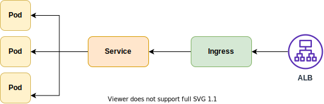

# 서비스 배포하기
본 실습에서는 웹 서비스를 구성하는 백앤드, 프론트앤드를 Amazon EKS에 배포하는 방법에 대해 알아봅니다. 각 서비스를 배포하는 순서는 아래와 같습니다.

- 소스 코드 다운로드

- Amazon ECR에 각 서비스에 대한 리포지토리 생성

- Dockerfile을 포함한 소스 코드 위치에서 컨테이너 이미지 빌드 후, 리포지토리에 푸시

- 각 서비스에 대한 Deployment, Service, Ingress 매니페스트 파일 생성 및 배포

아래의 그림은 사용자가 실제 서비스를 접근하는 순서를 나타냅니다.

[Previous](../60-ingress-controller/60-ingress-controller.md) | [Next](./100-flask-backend)