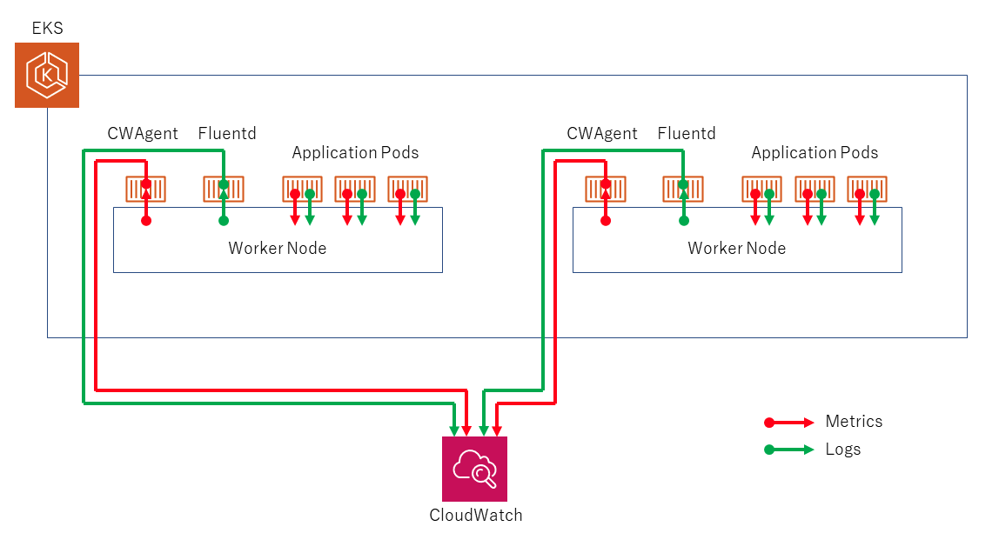
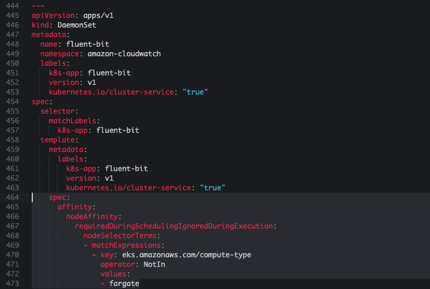
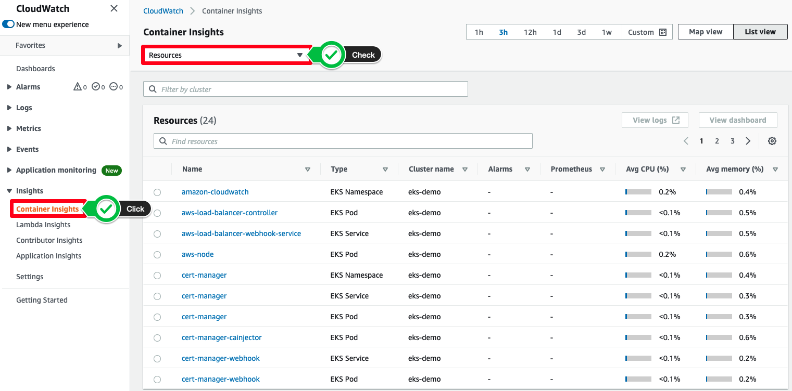
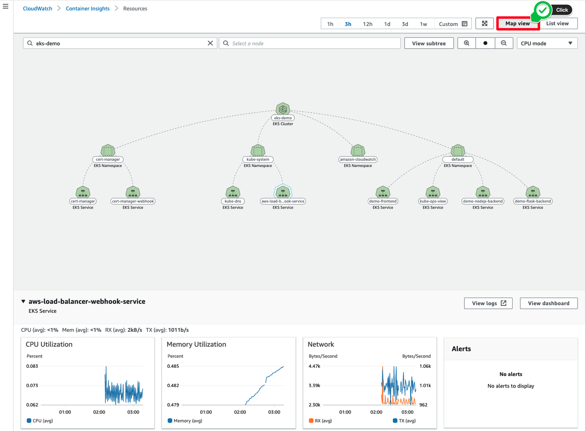
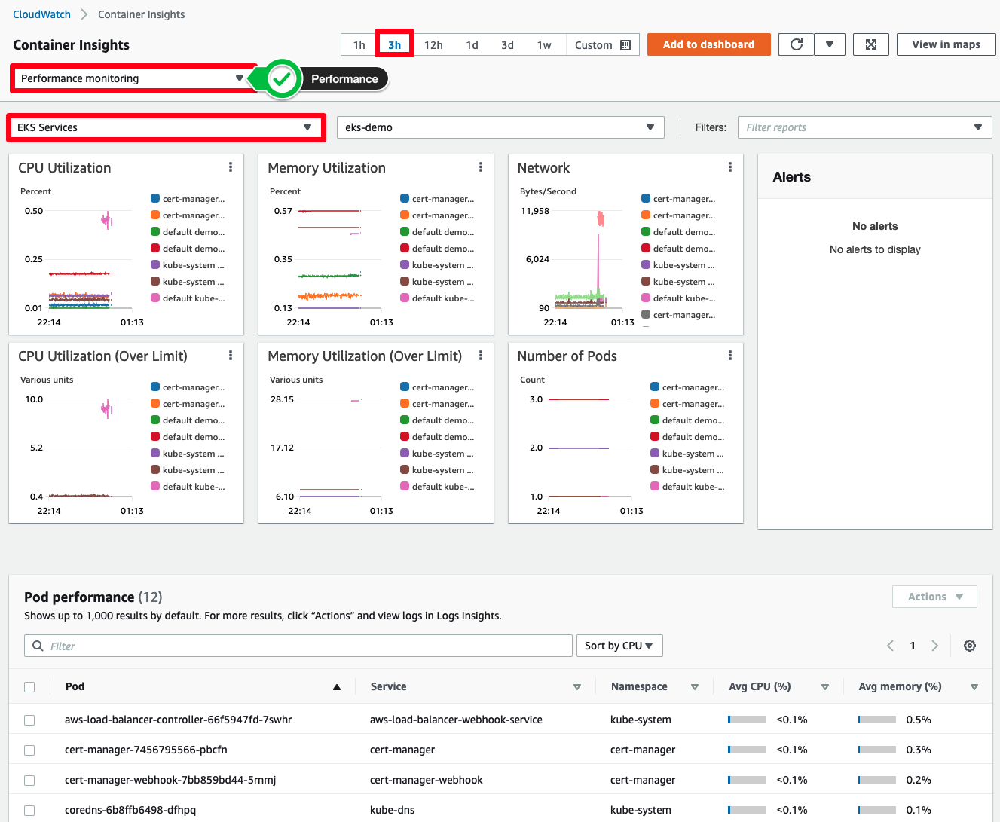
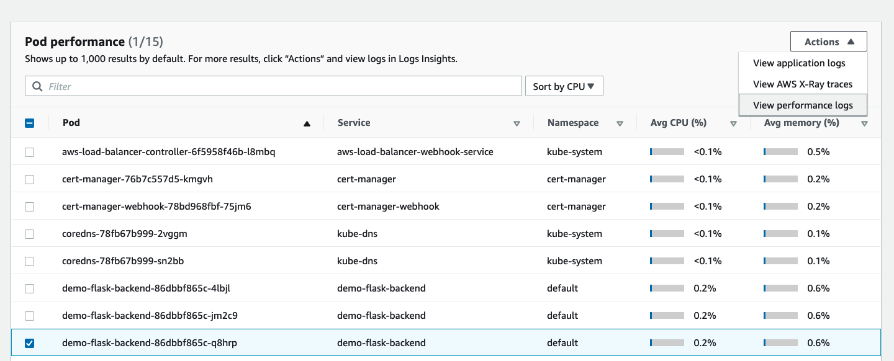
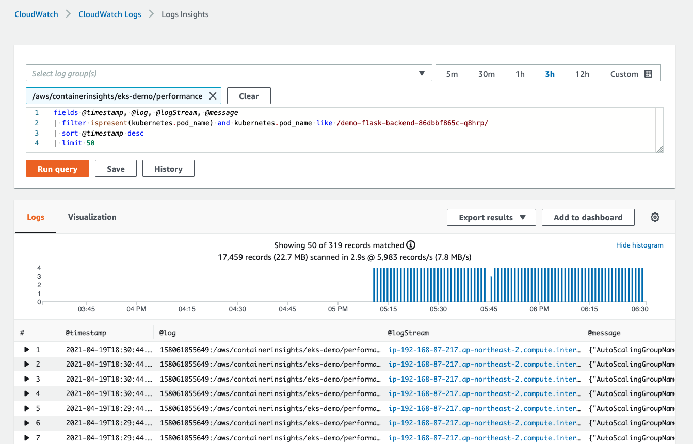

# EKS CloudWatch Container Insights 사용하기

본 실습에서는 Fluent Bit 를 사용하여 로그를 라우팅하는 작업을 수행합니다. 실습 순서는 클러스터의 메트릭 값을 수집하기 위해 CloudWatch Agent 설치하고, CloudWatch Logs에 로그를 보내기 위해 Fluent Bit을 DaemonSet 형태로 설치할 것입니다.



먼저, 앞으로의 매니페스트 파일을 관리하기 위해 폴더를 만들어 줍니다.

```
cd ~/environment
mkdir -p manifests/cloudwatch-insight && cd manifests/cloudwatch-insight
```

## CloudWatch agent, Fluent Bit 설치하기
[eksctl로 클러스터 생성하기](https://catalog.us-east-1.prod.workshops.aws/workshops/9c0aa9ab-90a9-44a6-abe1-8dff360ae428/ko-KR/50-eks-cluster/100-launch-cluster)에서 클러스터 컨피그 파일 안에 cloudWatch 관련 권한을 워커 노드에 넣도록 미리 설정하였습니다.

1. 아래의 명령어를 이용하여 amazon-cloudwatch라는 네임스페이스를 생성합니다.

```
kubectl create ns amazon-cloudwatch
```

[!] 정상적으로 생성되었다면 아래의 명령어에 대한 결과 값으로 해당 네임스페이스가 목록에 존재하게 됩니다.

```
kubectl get ns
```

2. 일부 설정 값을 명명한 후, CloudWatch 에이전트 및 Fluent Bit를 설치합니다. 한줄씩 복사, 붙여넣기 작업을 수행하면 됩니다.

```
ClusterName=eks-demo
RegionName=ap-northeast-2
FluentBitHttpPort='2020'
FluentBitReadFromHead='Off'
[[ ${FluentBitReadFromHead} = 'On' ]] && FluentBitReadFromTail='Off'|| FluentBitReadFromTail='On'
[[ -z ${FluentBitHttpPort} ]] && FluentBitHttpServer='Off' || FluentBitHttpServer='On'
```

RegionName의 경우, 현재 실습 진행 중인 리전의 이름을 입력하면 됩니다. 서울 리전에서 실습을 진행한다면 ap-northeast-2를 입력합니다.

그 다음, 아래의 명령어를 통해, yaml 파일을 다운로드합니다.

```
wget https://raw.githubusercontent.com/aws-samples/amazon-cloudwatch-container-insights/latest/k8s-deployment-manifest-templates/deployment-mode/daemonset/container-insights-monitoring/quickstart/cwagent-fluent-bit-quickstart.yaml
```

그 다음, 환경 변수 값을 해당 파일에 적용합니다.

```
sed -i 's/{{cluster_name}}/'${ClusterName}'/;s/{{region_name}}/'${RegionName}'/;s/{{http_server_toggle}}/"'${FluentBitHttpServer}'"/;s/{{http_server_port}}/"'${FluentBitHttpPort}'"/;s/{{read_from_head}}/"'${FluentBitReadFromHead}'"/;s/{{read_from_tail}}/"'${FluentBitReadFromTail}'"/' cwagent-fluent-bit-quickstart.yaml 
```

해당 파일을 오픈한 후, fluent-bit의 DaemonSet 객체를 찾은 다음 아래의 값을 464번 째 줄인 spec 밑에 추가합니다.

```
affinity:
  nodeAffinity:
    requiredDuringSchedulingIgnoredDuringExecution:
      nodeSelectorTerms:
      - matchExpressions:
        - key: eks.amazonaws.com/compute-type
          operator: NotIn
          values:
          - fargate
```

붙여 넣은 일부를 발췌한 결과는 아래와 같습니다. 들여쓰기에 주의하세요.



파일을 디플로이합니다

```
kubectl apply -f cwagent-fluent-bit-quickstart.yaml 
```

3. 아래의 명령어를 사용하여 정상적으로 설치되었는지 확인합니다. 이에 대한 결과로 cloudwatch-agent pod 및 fluent-bit pod가 각각 3개씩 나오면 됩니다.

```
kubectl get po -n amazon-cloudwatch
```

아래의 명령어를 통해서도 확인 가능합니다. 2개의 Daemonset이 출력되는 것을 확인할 수 있습니다.

```
kubectl get daemonsets -n amazon-cloudwatch
```

## CloudWatch 콘솔창에서 살펴보기

[Amazon CloudWatch 콘솔창](https://console.aws.amazon.com/cloudwatch) 에 접속한 후, 왼쪽 사이드바에서 Container Insights 아래 Resources를 클릭합니다. 아래와 같이 모든 리소스 리스트들이 반환됩니다.



오른쪽 상단의 Map View를 클릭하면 아래와 같이 클러스터의 리소스가 트리 형태로 표시됩니다. 또한, 특정 오브젝트를 클릭하면 아래와 같이 관련 메트릭 값도 확인할 수 있습니다.



그 다음, 왼쪽 사이드바에서 Performance monitoring를 클릭합니다. 그리고 상단에서 EKS Services를 클릭하면 아래와 같이 서비스 단위로 메트릭 값을 확인할 수 있습니다.



또한, 아래의 Pod performance에서 특정 파드를 선택 후, 우측 드롭박스에서 View performance logs를 클릭하면



아래와 같이 CloudWatch Logs Insights 화면으로 리다이렉션됩니다. 쿼리를 통해, 원하는 로그를 확인할 수 있습니다.



[Previous](./90-monitoring.md) | [Next](../100-scaling/100-scaling.md)