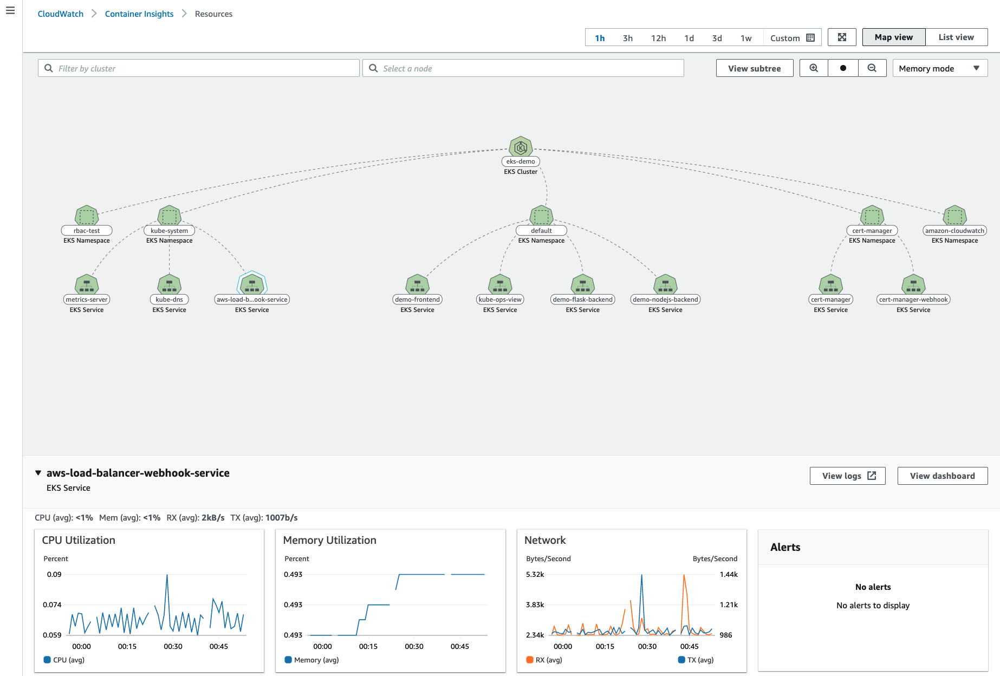

# Container Insights 사용하기

## Amazon CloudWatch Container Insight에 대하여

CloudWatch Container Insight는 컨테이너형 애플리케이션 및 마이크로 서비스에 대한 모니터링, 트러블 슈팅 및 알람을 위한 완전 관리형 관측 서비스입니다. CloudWatch Container Insight를 사용하면 CloudWatch 콘솔에서 자동화된 대시보드를 통해 container metrics, Prometeus metrics, application logs 및 performance log events를 탐색, 분석 및 시각화할 수 있습니다.

CloudWatch Container Insight는 CPU, 메모리, 디스크 및 네트워크와 같은 인프라 메트릭을 자동으로 수집합니다. 또한 EKS 클러스터의 crashloop backoffs와 같은 진단 정보를 제공하여 문제를 격리하고 신속하게 해결할 수 있도록 지원합니다. 이를 통해 사용자는 컨테이너 지표와 로그를 수집하고 모니터링하고 분석하고 그에 대응하는 데 필요한 여러 도구가 간소화되는 동시에 완벽하고 포괄적인 가시성을 확보하고, 개발자 생산성을 높이는 데 집중할 수 있습니다.

이러한 대시보드는 Amazon ECS, Amazon EKS, AWS ECS Fargate 그리고 EC2 위에 구동되는 k8s 클러스터에서 사용 가능합니다.

[Previous](../80-fargate/100-fargate-pod.md) | [Next](./100-build-insight.md)