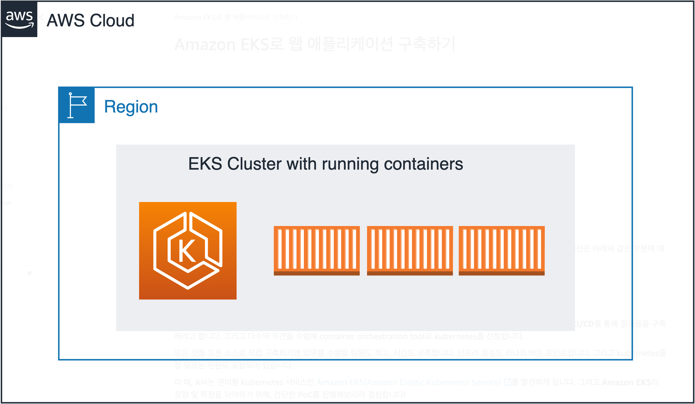

# Amazon EKS로 웹 애플리케이션 구축하기

국내 유명 기업의 DevOps 팀에 다니는 A씨는 새로운 웹 애플리케이션을 개발하는 프로젝트를 맡게 됩니다. 해당 애플리케이션은 아래와 같은 부분에 대응할 수 있어야 합니다.

- 새로운 요청이 있을 때, 변경 사항을 빠르게 반영
- 손쉬운 확장
- 적은 인원으로 운영 및 개발 업무 수행

위와 같은 요건을 확인한 A씨는 Modern Application을 구축하기로 결심했고, 팀원들과 상의한 끝에 MSA, container, CI/CD를 통해 결과물을 구축하려고 합니다. 그리고 다수의 의견을 수렴해 container orchestration tool로 kubernetes를 선정합니다.

모든 것을 오픈 소스로 직접 구축하기엔 업무를 수행할 팀원도 적고, 시간도 부족합니다. 인프라 증설도 하나의 버든 포인트입니다. 그리고 kubernetes를 잘 모르는 인원도 포함되어 있습니다.

이 때, A씨는 관리형 kubernetes 서비스인 [Amazon EKS(Amazon Elastic Kubernetes Service)](https://aws.amazon.com/ko/kubernetes/) 를 발견하게 됩니다. 그리고 Amazon EKS의 장점 및 특징을 파악하기 위해, 간단한 PoC를 진행해보리라 결심합니다!

본 실습은 컨테이너 이미지를 만드는 것을 시작으로 Amazon EKS에 컨테이너를 배포하여 웹 페이지를 올리는 것을 목표로 합니다. 실습을 통해, 컨테이너, 쿠버네티스 그리고 Amazon EKS와 함께 사용하는 다양한 AWS 서비스들에 대해 학습합니다.

- [워크샵 소개](./10-intro/10-intro.md)
- [워크샵 시작 전 준비 사항](./20-preq/20-preq.md)
- [실습 환경 구축](./30-setting/30-setting.md)
- [도커 컨테이너 구축하기](./40-container/40-container.md)
- [EKS 클러스터 생성하기](./50-eks-cluster/50-eks-cluster.md)
- [인그레스 컨트롤러 만들기](./60-ingress-controller/60-ingress-controller.md)
- [서비스 배포하기](./70-deploy-service/70-deploy-service.md)
- [AWS Fargate 사용하기](./80-fargate/80-fargate.md)
- [Container Insights 사용하기](./90-monitoring/90-monitoring.md)
- [Autoscaling Pod - Cluster](./100-scaling/100-scaling.md)
- [CI / CD for EKS Cluster](./110-cicd/110-cicd.md)
- [실습 리소스 정리하기](./900-cleanup/900-cleanup.md)  

<!-- [원본](https://catalog.us-east-1.prod.workshops.aws/v2/workshops/9c0aa9ab-90a9-44a6-abe1-8dff360ae428/ko-KR/)

<!-- [Previous] | [Next](./10-intro/10-intro.md)
